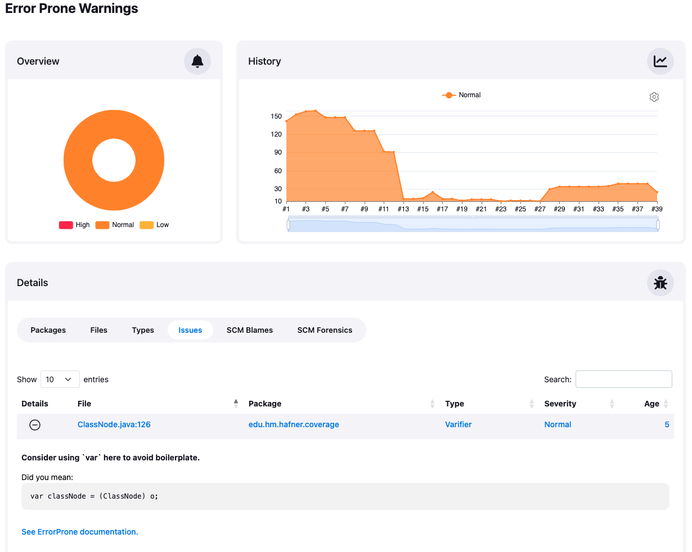
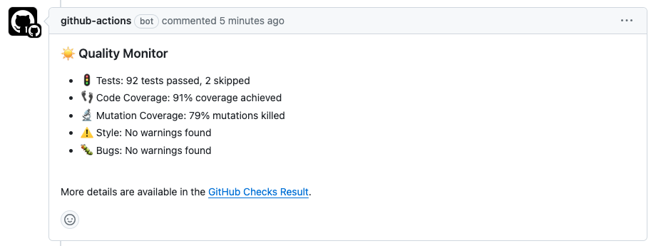

# Jenkins Warnings Next Generation Plugin

The Jenkins Next Generation Warnings plugin collects compiler warnings or issues reported by static analysis tools and visualizes the results. It has built-in support for more than a hundred [report formats](SUPPORTED-FORMATS.md). 
Among the problems it can detect:
- errors from your compiler (C, C#, Java, etc.)
- warnings from a static analysis tool (CheckStyle, StyleCop, SpotBugs, etc.)
- duplications from a copy-and-paste detector (CPD, Simian, etc.)
- vulnerabilities
- open tasks in comments of your source files

The plugin publishes a report of the issues found in your build, so you can navigate to a summary report from the main build page. From there you can also dive into the details: 
- distribution of new, fixed and outstanding issues
- distribution of the issues by severity, category, type, module, or package
- list of all issues including helpful comments from the reporting tool
- annotated source code of the affected files
- trend charts of the issues over time

This code of this plugin is also available as a standalone GitHub or GitLab action that runs without Jenkins now:
- [Quality Monitor GitHub Action](https://github.com/uhafner/quality-monitor): action that monitors the quality of projects based on a configurable set of metrics and gives feedback on pull requests (or single commits) in GitHub.
- [GitHub Autograding action](https://github.com/uhafner/autograding-github-action): action that automatically grades student software projects based on a configurable set of metrics and gives feedback on pull requests (or single commits) in GitHub.
- [GitLab Autograding action](https://github.com/uhafner/autograding-gitlab-action): action that automatically grades student software projects based on a configurable set of metrics and gives feedback on merge requests (or single commits) in GitLab.

If you are using Git as a source code management system then the warnings plugin will optionally mine 
the repository in the style of 
[Code as a Crime Scene](https://www.adamtornhill.com/articles/crimescene/codeascrimescene.htm) 
(Adam Tornhill, November 2013) to determine statistics of the affected files (i.e. the files with issues):
- commits count
- different authors count
- creation time
- last modification time
- lines of code (from the commit details)
- code churn (changed lines since created)

Additionally, the plugin shows the last person who modified the code that contains an issue (and the last commit ID).
In order to use this functionality you need to install the optional 
[Git Forensics Plugin](https://github.com/jenkinsci/git-forensics-plugin).

If your tool is not yet supported by the warnings plugin you can either define a new Groovy based parser in the 
user interface or provide a parser within a new small plug-in. If the parser is useful for other teams as well 
please share it and provide pull requests for the 
[Warnings Next Generation Plug-in](https://github.com/jenkinsci/warnings-ng-plugin/pulls) and 
the [Analysis Parsers Library](https://github.com/jenkinsci/analysis-model/pulls). 

For more details please refer to the [documentation](doc/Documentation.md) or to an 
[introductory video](https://www.youtube.com/watch?v=0GcEqML8nys). Contributions are welcome, please 
refer to the separate [CONTRIBUTING](CONTRIBUTING.md) document
for details on how to proceed!

All source code is licensed under the MIT license.

