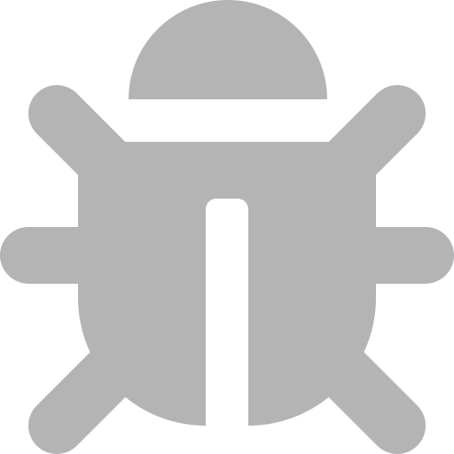

<!--- DO NOT EDIT - Generated by ToolsLister at 2021-11-14T22:18:08.174543-->
# Supported Report Formats

Jenkins' Warnings Next Generation Plugin supports the following report formats. 
If your tool is supported, but has no custom icon yet, please file a pull request for the
[Warnings Next Generation Plugin](https://github.com/jenkinsci/warnings-ng-plugin/pulls).

If your tool is not yet supported you can
1. define a new Groovy based parser in the user interface
2. export the issues of your tool to the native XML format (or any other format)
3. provide a parser within a new small plugin. 

If the parser is useful for 
other teams as well please share it and provide pull requests for the 
[Warnings Next Generation Plug-in](https://github.com/jenkinsci/warnings-ng-plugin/pulls) and 
the [Analysis Parsers Library](https://github.com/jenkinsci/analysis-model/). 

| Number | ID | Symbol | Icons | Name | Default Pattern |
| --- | --- | --- | --- | --- | --- |
| 0 | acu-cobol | acuCobol() |   | AcuCobol |  |
| 1 | gnat | gnat() |   | Ada Compiler (gnat) |  |
| 2 | android-lint | androidLintParser() |   | Android Lint |  |
| 3 | ansiblelint | ansibleLint() |   | Ansible Lint |  |
| 4 | trivy | trivy() |   | [Aquasec Trivy](https://github.com/aquasecurity/trivy) |  |
| 5 | armcc | armCc() |   | Armcc Compiler |  |
| 6 | aspectj | ajc() |   | AspectJ |  |
| 7 | axivion-suite | axivionSuite() |   | Axivion Suite | - |
| 8 | brakeman | brakeman() |   | [Brakeman](https://brakemanscanner.org) | **/brakeman-output.json |
| 9 | buckminster | buckminster() |   | Buckminster |  |
| 10 | cpplint | cppLint() |   | C&#43;&#43; Lint |  |
| 11 | cadence | cadence() |   | Cadence Incisive |  |
| 12 | cargo | cargo() |   | Cargo Check |  |
| 13 | ccm | ccm() |   | CCM |  |
| 14 | checkstyle | checkStyle() |   | [CheckStyle](https://checkstyle.org) | **/checkstyle-result.xml |
| 15 | clair | clair() |   | [Clair Scanner](https://github.com/arminc/clair-scanner) |  |
| 16 | clang | clang() |   | Clang |  |
| 17 | clang-analyzer | clangAnalyzer() |   | [Clang Analyzer](https://clang-analyzer.llvm.org) |  |
| 18 | clang-tidy | clangTidy() |   | Clang-Tidy |  |
| 19 | cmake | cmake() |   | CMake |  |
| 20 | code-analysis | codeAnalysis() |   | Code Analysis |  |
| 21 | code-checker | codeChecker() |   | CodeChecker |  |
| 22 | codenarc | codeNarc() |   | CodeNarc |  |
| 23 | coolflux | coolflux() |   | Coolflux DSP Compiler |  |
| 24 | cpd | cpd() |   | [CPD](https://pmd.github.io/latest/pmd_userdocs_cpd.html) | **/cpd.xml |
| 25 | cppcheck | cppCheck() |   | CPPCheck |  |
| 26 | csslint | cssLint() |   | CSS-Lint |  |
| 27 | detekt | detekt() |   | [Detekt](https://detekt.github.io/detekt) |  |
| 28 | docfx | docFx() |   | DocFX |  |
| 29 | dockerlint | dockerLint() |   | [Dockerfile Lint](https://github.com/projectatomic/dockerfile_lint) |  |
| 30 | doxygen | doxygen() |   | Doxygen |  |
| 31 | dr-memory | drMemory() |   | Dr. Memory |  |
| 32 | dscanner | dscanner() |   | [DScanner](https://github.com/dlang-community/D-Scanner) | **/dscanner-report.json |
| 33 | eclipse | eclipse() |   | Eclipse ECJ |  |
| 34 | erlc | erlc() |   | Erlang Compiler (erlc) |  |
| 35 | error-prone | errorProne() |   | [Error Prone](https://errorprone.info) |  |
| 36 | eslint | esLint() |   | [ESlint](https://eslint.org) |  |
| 37 | findbugs | findBugs() |   | FindBugs | **/findbugsXml.xml |
| 38 | flake8 | flake8() |   | [Flake8](https://flake8.pycqa.org/) |  |
| 39 | flawfinder | flawfinder() |   | [FlawFinder](https://dwheeler.com/flawfinder/) |  |
| 40 | flex | flexSdk() |   | Flex SDK Compiler |  |
| 41 | fxcop | fxcop() |   | FxCop |  |
| 42 | gendarme | gendarme() |   | Gendarme |  |
| 43 | ghs-multi | ghsMulti() |   | GHS Multi Compiler |  |
| 44 | gcc | gcc() |   | GNU C Compiler (gcc) |  |
| 45 | gcc3 | gcc3() |   | GNU C Compiler 3 (gcc) |  |
| 46 | fortran | gnuFortran() |   | GNU Fortran Compiler |  |
| 47 | golint | goLint() |   | Go Lint |  |
| 48 | go-vet | goVet() |   | Go Vet |  |
| 49 | groovy | groovyScript() |   | Groovy Parser | - |
| 50 | hadolint | hadoLint() |   | [HadoLint](https://github.com/hadolint/hadolint) |  |
| 51 | iar-cstat | iarCstat() |   | IAR C-STAT |  |
| 52 | iar | iar() |   | IAR Compiler (C/C&#43;&#43;) |  |
| 53 | iblinter | ibLinter() |   | [IbLinter](https://github.com/IBDecodable/IBLinter) |  |
| 54 | xlc | xlc() |   | IBM XLC Compiler |  |
| 55 | infer | infer() |   | [Infer](https://fbinfer.com) |  |
| 56 | intel | intel() |   | Intel Compiler (C, Fortran) |  |
| 57 | idea | ideaInspection() |   | [IntelliJ IDEA Inspections](https://www.jetbrains.com/help/idea/code-inspection.html) |  |
| 58 | java | java() |   | Java Compiler |  |
| 59 | javadoc-warnings | javaDoc() |   | JavaDoc |  |
| 60 | jc-report | jcReport() |   | JCReport |  |
| 61 | js-hint | jsHint() |   | JsHint |  |
| 62 | jslint | jsLint() |   | [JSLint](https://www.jslint.com) |  |
| 63 | junit | junitParser() |   | [JUnit](https://junit.org) |  |
| 64 | klocwork | klocWork() |   | Klocwork |  |
| 65 | kotlin | kotlin() |   | Kotlin |  |
| 66 | ktlint | ktLint() |   | [KtLint](https://ktlint.github.io) |  |
| 67 | maven-warnings | mavenConsole() |   | Maven |  |
| 68 | taglist | tagList() |   | [Maven Taglist Plugin](https://www.mojohaus.org/taglist-maven-plugin) | **/taglist.xml |
| 69 | modelsim | modelsim() |   | Mentor Graphics Modelsim/Questa Simulators |  |
| 70 | metrowerks | metrowerksCodeWarrior() |   | Metrowerks CodeWarrior Compiler |  |
| 71 | msbuild | msBuild() |   | MSBuild |  |
| 72 | mypy | myPy() |   | MyPy |  |
| 73 | nag-fortran | nagFortran() |   | NAG Fortran Compiler |  |
| 74 | issues | issues() |   | [Native Analysis Model Format](https://github.com/jenkinsci/warnings-ng-plugin/blob/master/doc/Documentation.md#export-your-issues-into-a-supported-format) |  |
| 75 | oelint-adv | oelintAdv() |   | [oelint-adv](https://github.com/priv-kweihmann/oelint-adv) |  |
| 76 | open-tasks | taskScanner() |   | Open Tasks Scanner | - |
| 77 | invalids | invalids() |   | Oracle Invalids |  |
| 78 | ot-docker-linter | otDockerLint() |   | [OT Docker Linter](https://github.com/opstree/OT-Dockerlinter) |  |
| 79 | pclint | pcLint() |   | PC-Lint Tool |  |
| 80 | pep8 | pep8() |   | PEP8 |  |
| 81 | perforce | perforce() |   | Perforce Compiler |  |
| 82 | perl-critic | perlCritic() |   | Perl::Critic |  |
| 83 | php | php() |   | PHP Runtime |  |
| 84 | php-code-sniffer | phpCodeSniffer() |   | [PHP_CodeSniffer](https://github.com/squizlabs/PHP_CodeSniffer) |  |
| 85 | phpstan | phpStan() |   | [PHPStan](https://github.com/phpstan/phpstan) |  |
| 86 | pit | pit() |   | [PIT](https://pitest.org) | **/mutations.xml |
| 87 | pmd | pmdParser() |   | [PMD](https://pmd.github.io) | **/pmd.xml |
| 88 | prefast | prefast() |   | PREfast |  |
| 89 | protolint | protoLint() |   | [ProtoLint](https://github.com/yoheimuta/protolint) |  |
| 90 | puppetlint | puppetLint() |   | Puppet Lint |  |
| 91 | pvs-studio | PVSStudio() |   | [PVS-Studio](https://pvs-studio.com/en/pvs-studio/) | **/*.plog |
| 92 | pydocstyle | pyDocStyle() |   | PyDocStyle |  |
| 93 | pylint | pyLint() |   | Pylint |  |
| 94 | qac | qacSourceCodeAnalyser() |   | QA-C Sourcecode Analyser |  |
| 95 | qt-translation | qtTranslation() |   | [Qt translations](https://www.qt.io) |  |
| 96 | analysis-model | analysisParser() |   | RegisteredParser | - |
| 97 | dupfinder | dupFinder() |   | Resharper DupFinder |  |
| 98 | resharper | resharperInspectCode() |   | Resharper Inspections |  |
| 99 | robocopy | robocopy() |   | Robocopy |  |
| 100 | rflint | rfLint() |   | Robot Framework Lint |  |
| 101 | rubocop | ruboCop() |   | Rubocop |  |
| 102 | scala | scala() |   | Scala Compiler |  |
| 103 | simian | simian() |   | Simian |  |
| 104 | sonar | sonarQube() |   | SonarQube Issues | **/sonar-report.json |
| 105 | sphinx | sphinxBuild() |   | Sphinx Build |  |
| 106 | spotbugs | spotBugs() |   | [SpotBugs](https://spotbugs.github.io) | **/spotbugsXml.xml |
| 107 | stylecop | styleCop() |   | StyleCop |  |
| 108 | sunc | sunC() |   | SUN C&#43;&#43; Compiler |  |
| 109 | swiftlint | swiftLint() |   | [SwiftLint](https://github.com/realm/SwiftLint) |  |
| 110 | tasking-vx | taskingVx() |   | TASKING VX Compiler |  |
| 111 | code-composer | tiCss() |   | Texas Instruments Code Composer Studio |  |
| 112 | tnsdl | tnsdl() |   | TNSDL Translator |  |
| 113 | tslint | tsLint() |   | [TSLint  ](https://palantir.github.io/tslint/) |  |
| 114 | diabc | diabC() |   | Wind River Diab Compiler (C/C&#43;&#43;) |  |
| 115 | xmllint | xmlLint() |   | XML-Lint |  |
| 116 | yamllint | yamlLint() |   | [YamlLint](https://yamllint.readthedocs.io/) |  |
| 117 | yui | yuiCompressor() |   | YUI Compressor |  |
| 118 | zptlint | zptLint() |   | ZPT-Lint |  |
