# Jenkins Warnings Next Generation Plugin

The Jenkins Warnings Next Generation Plugin collects compiler warnings or issues reported by static analysis tools 
and visualizes the results. It has built-in support for numerous static analysis tools (including several compilers), 
see the list of [supported report formats](../SUPPORTED-FORMATS.md). 

## Supported project types

The Warnings Next Generation plugin supports the following Jenkins project types:

- Freestyle Project
- Maven Project
- Matrix Project
- Scripted Pipeline (sequential and parallel steps)
- Declarative Pipeline (sequential and parallel steps)
- Multi-branch Pipeline

## Features overview 

The Warnings Next Generation Plugin provides the following features when added as a post build action (or step) 
to a job: 

1. The plugin scans the console log of a Jenkins build or files in the workspace of your job for any kind of issues. 
There are more than hundred [report formats](../SUPPORTED-FORMATS.md) supported. Among the problems it can detect:
    - errors from your compiler (C, C#, Java, etc.)
    - failures from your test reports (JUnit, etc.)
    - warnings from a static analysis tool (CheckStyle, StyleCop, SpotBugs, etc.)
    - duplications from a copy-and-paste detector (CPD, Simian, etc.)
    - vulnerabilities
    - open tasks in comments of your source files
2. The plugin publishes a report of the issues found in your build, so you can navigate to a summary report from the 
main build page. From there you can also dive into the details: 
    - distribution of new, fixed and outstanding issues
    - distribution of issues in modified files
    - distribution of issues by severity, category, type, module, or package
    - list of all issues including helpful comments from the reporting tool
    - annotated source code of the affected files
    - trend charts of the issues 
    - blames that identify the origin (commit, author, etc.) of a warning
    - forensics that give insight to your SCM history
   
:exclamation: The plugin does not run the static analysis, it just visualizes the results reported by such tools. You still need to enable and configure the static analysis tool in your build file or Jenkinsfile. 
 
## Table of Contents

* [Jenkins Warnings Next Generation Plugin](#jenkins-warnings-next-generation-plugin)
  * [Supported project types](#supported-project-types)
  * [Features overview](#features-overview)
  * [Table of Contents](#table-of-contents)
* [Configuration](#configuration)
  * [Tool selection](#tool-selection)
  * [Creating support for a custom tool](#creating-support-for-a-custom-tool)
    * [Export your issues into a supported format](#export-your-issues-into-a-supported-format)
    * [Deploying a new tool using a custom plugin](#deploying-a-new-tool-using-a-custom-plugin)
    * [Creating a new tool using a Groovy parser](#creating-a-new-tool-using-a-groovy-parser)
    * [Creating a Groovy parser programmatically](#creating-a-groovy-parser-programmatically)
    * [Importing a parser using configuration as code (JCasC)](#importing-a-parser-using-configuration-as-code-jcasc)
    * [Using the defined tool](#using-the-defined-tool)
  * [Properties to process the affected source code files](#properties-to-process-the-affected-source-code-files)
  * [Control the selection of the reference build (baseline)](#configure-the-selection-of-the-reference-build-baseline)
  * [Filtering issues](#filtering-issues)
  * [Quality gate configuration](#quality-gate-configuration)
  * [Health report configuration](#health-report-configuration)
  * [Pipeline configuration](#pipeline-configuration)
    * [Simple Pipeline configuration](#simple-pipeline-configuration)
    * [Declarative Pipeline configuration](#declarative-pipeline-configuration)
    * [Advanced Pipeline configuration](#advanced-pipeline-configuration)
* [Feature Overview](#feature-overview)
  * [Issues history: new, fixed, and outstanding issues](#issues-history-new-fixed-and-outstanding-issues)
  * [Severities](#severities)
  * [Build trend](#build-trend)
    * [Distribution of issues by severity](#distribution-of-issues-by-severity)
    * [Issues per static analysis type](#issues-per-static-analysis-type)
    * [New vs. Fixed issues](#new-vs-fixed-issues)
    * [Health of the project](#health-of-the-project)
    * [Zooming](#zooming)
    * [Build vs. Date Axis](#build-vs-date-axis)
  * [Issues overview](#issues-overview)
  * [Issues details](#issues-details)
  * [Source code blames (for Git projects)](#source-code-blames-for-git-projects)
  * [Repository forensics (for Git projects)](#repository-forensics-for-git-projects)
  * [Source code view](#source-code-view)
  * [Issues Totals Column](#issues-totals-column)
  * [Dashboard view support](#dashboard-view-support)
    * [Issues per tool and job table](#issues-per-tool-and-job-table)
    * [Issues trend](#issues-trend)
  * [Remote API](#remote-api)
    * [Aggregation summary of all analysis results](#aggregation-summary-of-all-analysis-results)
    * [Summary of the analysis result](#summary-of-the-analysis-result)
    * [Details of the analysis result](#details-of-the-analysis-result)
  * [Token macro support](#token-macro-support)
  * [Warnings Checks (for GitHub projects)](#warnings-checks-for-github-projects)

Created by [gh-md-toc](https://github.com/ekalinin/github-markdown-toc)

# Configuration

You can configure every option of the plugin in Jenkins job configuration user interface (in freestyle, maven, or 
matrix jobs). Here you need to add and enable the post build action *"Record compiler warnings and static 
analysis results"* to your job. 

In pipelines the plugin will be activated by adding the step `recordIssues`. This step can be configured with the same 
user interface as well (by using the Snippet editor). Note that for scripted pipelines some additional features are 
available to aggregate and group issues, see [section Advanced Pipeline Configuration](#advanced-pipeline-configuration) 
for details. 

In the following sections, both the graphical configuration and the pipeline configuration are shown side by side.
    
### Tool selection

The basic configuration of the plugin is shown in the image above:

 

First, you need to specify the tool that should be used to create the issues.
Depending on the selected tool you might configure some additional parameters as well. 

For all parsers that read report files you need to specify the pattern of the report files that should be parsed and scanned for issues. 
If you do not specify a pattern, then the console log of your build will be scanned. For several popular tools a default
pattern has been provided: in this case the default pattern will be used if the pattern is empty.  

In order to let the scanner parse correctly your reports it is required to set the encoding of the files, 
otherwise the platform encoding will be used which might be incorrect. 

Each tool is identified by an ID that is used as URL to the results of the analysis. For each tool, a default URL 
(and name) is provided that can be changed if required. E.g., if you are going to use a parser multiple
times then you need to specify different IDs for each of the invocations.  

You can specify multiple tools (and patterns) that will be used with the same configuration. Due to a technical 
(or marketing) limitation of Jenkins it is not possible to select different configurations by using multiple post build 
actions.  

One new feature is available by using the checkbox *"Aggregate Results"*: if this option is selected, then one result
is created that contains an aggregation of all issues of the selected tools. This is something the 
Static Analysis Collector Plugin provided previously. When this option is activated you get a unique entry point 
for all of your issues. The following screenshot shows this new behavior: 

 

If this option is not enabled, then for each tool a separate result will be created. This result has a unique URL and
icon, so you quickly see the difference between the created reports:

 

In the basic configuration section you can additionally choose if the step should run for failed builds as well.
This option is disabled by default, since analysis results might be inaccurate if the build failed.
 
An example pipeline with these options is shown in the following snippet:

```groovy
recordIssues(
    enabledForFailure: true, aggregatingResults: true, 
    tools: [java(), checkStyle(pattern: 'checkstyle-result.xml', reportEncoding: 'UTF-8')]
)
```

If you are using a single tool you can use the property `tool` instead of `tools`: 

```groovy
recordIssues enabledForFailure: true, aggregatingResults: true, tool: checkStyle(pattern: 'checkstyle-result.xml')
```

If you prefer to hide logging: 

```groovy
recordIssues quiet: true, enabledForFailure: true, aggregatingResults: true, tool: checkStyle(pattern: 'checkstyle-result.xml')
```

### Referencing tools by id

As seen in the section above, a parser can be selected by specifying a pre-defined pipeline symbol in a Jenkinsfile.
This is convenient for users but requires a change in the analysis-model module and the warnings plugin for each new
parser. So a simplification has been added in release 10.x of the analysis-model module: you can now select a parser 
simply by using the corresponding ID and the generic tool symbol `analysisModel`. 

#### Pipeline step with a specific symbol

```groovy
recordIssues tool: checkStyle(pattern: 'checkstyle-result.xml')
```

#### Pipeline step with a generic symbol

```groovy
recordIssues tool: analysisParser(pattern: 'checkstyle-result.xml', analysisModelId: 'checkstyle')
```

### Creating support for a custom tool

If none of the built-in tools works in your project you have several ways to add additional tools. 

#### Export your issues into a supported format

A simple way to get the analysis results of your tool into the Warnings plugin is to export the information into one
of the already supported formats. E.g., several tools export their issues into the CheckStyle or PMD format. If you
want to use all features of the Warnings Plugin it would be even better if you would export the information into the
*native* [XML](../plugin/src/test/resources/io/jenkins/plugins/analysis/warnings/steps/warnings-issues.xml) or 
[JSON](../plugin/src/test/resources/io/jenkins/plugins/analysis/warnings/steps/issues.json) format (this parser uses the ID `issues`).  
These formats are already registered in the user interface, and you can use them out-of-the-box. You can even provide
issues in a simple log file that contains single lines of JSON issues, see 
[example](../plugin/src/test/resources/io/jenkins/plugins/analysis/warnings/steps/json-issues.log).

Here is an example step that can be used to parse the native JSON (or XML) format:

```groovy
recordIssues(tool: issues(pattern: '**/issues.json'))
```

Note: The native format parser requires a file pattern and cannot scan console log output directly.
#### Deploying a new tool using a custom plugin

The most flexible way is to define a new tool by writing a Java class that will be deployed in your own small 
Jenkins plugin, see document ["Providing support for a custom static analysis tool"](Custom-Plugin.md) for details. 

#### Creating a new tool using a Groovy parser

If the format of your log messages is quite simple then you can define support for your tool by creating a simple 
tool configuration in Jenkins' user interface. Due to security reasons (Groovy scripts can compromise your master) 
this configuration is available in the system configuration only. 
The configuration of a new parser takes a regular expression that will be used to 
match the report format. If the expression matches, then a Groovy script will be invoked that converts the matching 
text into an issue instance. Here is an example of such a Groovy based parser:

  

#### Creating a Groovy parser programmatically

The Groovy based parser can also be created using a Groovy script from within a pipeline, a Jenkins startup script or the script console.

See the following example:

```groovy
def config = io.jenkins.plugins.analysis.warnings.groovy.ParserConfiguration.getInstance()

if(!config.contains('pep8-groovy')){
    def newParser = new io.jenkins.plugins.analysis.warnings.groovy.GroovyParser(
        'pep8-groovy', 
        'Pep8 Groovy Parser', 
        '(.*):(\\d+):(\\d+): (\\D\\d*) (.*)', 
        'return builder.setFileName(matcher.group(1)).setCategory(matcher.group(4)).setMessage(matcher.group(5)).buildOptional()', 
        "optparse.py:69:11: E401 multiple imports on one line"
    )
    config.addParser(newParser)
}
```

The following variables are automatically injected into the script by the plugin:
* `builder`: fluent API based builder for creating new issues (see above code snippet)
* `matcher`: regular expression matcher (can be used to get more details on regular expression match)
* `fileName`: name of the file (or console) being analyzed
* `lineNumber`: current line number containing the match

#### Importing a parser using configuration as code (JCasC)

Groovy based parsers can also be specified using a section in your
[JCasC yaml file](https://github.com/jenkinsci/configuration-as-code-plugin). Here is a small example that shows how to
 add such a parser:
```yaml
unclassified:
  warningsParsers:
    parsers:
      - name: "Example parser"
        id: example-id
        regexp: "^\\s*(.*):(\\d+):(.*):\\s*(.*)$"
        script: |
          import edu.hm.hafner.analysis.Severity
          builder.setFileName(matcher.group(1))
                  .setLineStart(Integer.parseInt(matcher.group(2)))
                  .setSeverity(Severity.WARNING_NORMAL)
                  .setCategory(matcher.group(3))
                  .setMessage(matcher.group(4))
          return builder.buildOptional();
        example: "somefile.txt:2:SeriousWarnings:SomethingWentWrong"
``` 

#### Using the defined tool

Once your Groovy parser has been registered you can use it in the tool configuration section of your job: 

  

First of all, you need to choose the tool "Groovy Parser" in order to get the configuration screen for the Groovy
parser. Then you can select the parser from the list of available parsers. This list is dynamically created based
on the parsers that are defined in Jenkins' system configuration section. The custom ID and name properties can 
be set in the same way as for the other tools.

In order to use a Groovy parser in a pipeline you need to use a script statement of the following form:

```groovy
recordIssues sourceCodeEncoding: 'UTF-8', 
    tool: groovyScript(parserId: 'groovy-id-in-system-config', pattern:'**/*report.log', reportEncoding:'UTF-8')
```

### Properties to process the affected source code files

In order to let the plugin parse and display your source code files it is required to set the correct 
encoding for these files. Additionally, if your source code is not located in the workspace (e.g. it has been checked 
out into a shared agent folder), the plugin will not automatically find your source files. 
In order to let the plugin display those files, you can add a source directory:

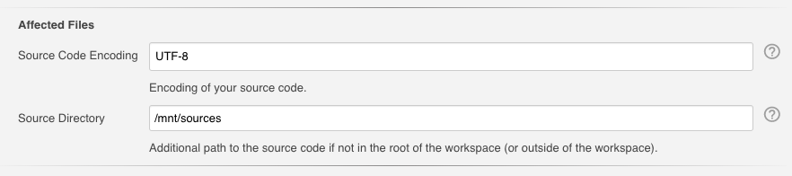 

To enable additional source directories for scanning, the directories have to be added in the global configuration. 
To select enabled directories for scanning, the directories have to be configured on job level.

An example pipeline with these options is shown in the following snippet, note that the encoding of the report 
files may be set differently if required:

```groovy
recordIssues sourceCodeEncoding: 'ISO-8859-1', sourceDirectory: '/path/to/sources', tool: java(reportEncoding: 'UTF-8')
```

Note that the content of files outside of the workspace might be sensitive. In order 
to prevent showing such files by accident, you need to provide an allowlist of allowed source code directories 
in Jenkins system configuration screen:

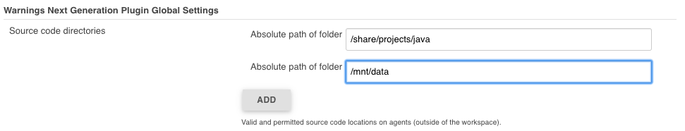 

Alternatively, this configuration setting can be provided by the follwoing subsection in your
[JCasC yaml file](https://github.com/jenkinsci/configuration-as-code-plugin):

```yaml
unclassified:
  warningsPlugin:
    sourceDirectories:
    - path: "C:\\Temp"
    - path: "/mnt/sources"
``` 


### Configure the selection of the reference build (baseline)

One unique feature of the Warnings Next Generation plugin is the classification of issues as new, outstanding and fixed:
- **new**: all issues, that are part of the current report but have not been shown up in the reference report
- **fixed**: all issues, that are part of the reference report but are not present in the current report anymore
- **outstanding**: all issues, that are part of the current and reference report
Using this classification one can see what new issues have been caused by a pull request, or if
 new and fixed issues are in balance or if the quality of the project is degenerating or improving.

To compute this classification, the plugin requires a reference build (baseline). New, fixed, and outstanding issues are then computed by comparing the issues in the current build and in the baseline. The selection of the reference build is delegated to the [Forensics API plugin](https://github.com/jenkinsci/forensics-api-plugin) and the corresponding Git implementation in the [Git Forensics plugin](https://github.com/jenkinsci/git-forensics-plugin). So make sure that you run the corresponding steps or post build actions in your build.

When selecting a baseline, we need to distinguish two different use cases, which are documented in the next sections.

### Selecting a baseline from the current job

When a team wants to investigate how the quality of the project changes over time, we need to look back in the history of the same Jenkins job. In this case, we need to select a previous build of the same job that we can use to compare the results with. Such a Jenkins job typically builds the main branch of the source control system. To get this functionality, you need to invoke the [discoverReferenceBuild](https://www.jenkins.io/doc/pipeline/steps/forensics-api/#discoverreferencebuild-discover-reference-build) step of the forensics plugin before running one of the steps of the warnings plugin. You do not need to specify a name for the reference job, as by default, the current job will be used.

You can affect the selection of the reference build with the following property:

- `ignoreQualityGate`: This option is only available if you have a quality gate enabled for your job. Then you can enable this option to always select the previous build as baseline. That means that the plugin marks only those issues as new that have been submitted in the current build. Previously new issues in older builds will the plugin convert and classify as outstanding issues. Think carefully before selecting this option because then manually starting a new build (without source code changes) will convert all previously new issues to outstanding. Therefore, this option is disabled by default: a reference build is always a build that passed all quality gates. As soon as a build does not pass the quality gate, the reference will be frozen until all new issues will be resolved again. This means, that new issues will be aggregated from build to build until the original cause for the failure, and all those additional new issues have been resolved. This helps much more to keep your project clean: as soon as there are new issues, Jenkins will mark all builds as unstable until the issues have been resolved.

You can use checkboxes to change the default values of these options, see image below.

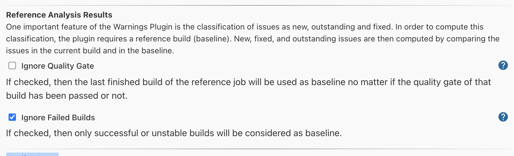

These options are available for pipelines as well: 

```groovy
discoverReferenceBuild()
recordIssues tool: java(), ignoreQualityGate: false, ignoreFailedBuilds: true
```

### Selecting a baseline in the target job

:warning: This feature requires the installation of an additional plugin:
[Git Forensics Plugin](https://github.com/jenkinsci/git-forensics-plugin).

For more complex [multibranch projects](https://www.jenkins.io/doc/book/pipeline/multibranch/), it makes more sense to select a reference build from a job that builds the actual target branch (i.e., the branch the current changes will be merged into). Such multibranch Pipelines build several branches and pull requests in a connected job hierarchy. 

Here one typically is interested what changed in the branch or pull request over the main branch (or any other target branch). That means we want to see what new warnings will be submitted by a branch or pull request if the team merges the changes. 

If you are using a Git branch source project, the Jenkins job that builds the target branch will be selected automatically by running the reference recorder step. Simply call the step [discoverGitReferenceBuild](https://www.jenkins.io/doc/pipeline/steps/git-forensics/#discovergitreferencebuild-discover-git-reference-build) before any of static analysis steps:

```groovy
discoverGitReferenceBuild()
recordIssues tool: checkStyle(pattern: 'checkstyle-result.xml')
```

Selecting the correct reference build is not that easy as it looks, since the main branch of a project will evolve more frequently than a specific feature or bugfix branch. That means if we want to compare the results of a pull request with the results of the main branch, we need to select a build carefully. Such a build must be in the job for the main branch and must contain only commits that are also part of the branch of the associated pull request.    

Therefore, the Git Forensics plugin automatically tracks all commits of a Jenkins build and uses this information to identify a build in the target branch that matches best with the commits in the current branch. Please have a look at the [documentation of the Git Forensics plugin](https://github.com/jenkinsci/git-forensics-plugin) to see how 
this is achieved in detail. 

This algorithm can be used for plain Git SCM freestyle projects or pipelines as well. In this case, we cannot get the target branch information automatically from the Git branch source API. Therefore, you need to manually specify the Jenkins job that builds the target branch in the parameter `referenceJob`. See the following sample pipeline snippet for an example on how to discover a baseline from such a reference job:

```groovy
    discoverGitReferenceBuild referenceJob: 'my-reference-job'
    recordIssues tool: checkStyle(pattern: 'checkstyle-result.xml')
```

Please note that the parameter `referenceJob` can be used even for non-Git projects: in that case, the algorithm selects the baseline from the specified job using the same techniques as described in [the previous section](#selecting-a-baseline-from-the-current-job). However, this may lead to inaccurate results if the main branch diverged too heavily from the starting point of the current branch. See the following sample snippet that shows the relevant options for this feature. 

```groovy
    discoverGitReferenceBuild referenceJob: 'my-project/main-branch'
    recordIssues tool: java(), ignoreQualityGate: false, ignoreFailedBuilds: true
```

A corresponding Freestyle configuration is given in the following screenshot. 

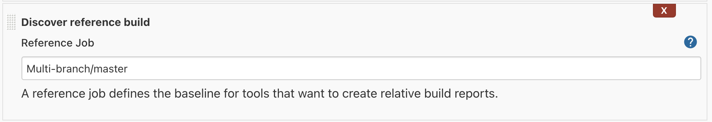


### Filtering issues

The created report of issues can be filtered afterward. You can specify an arbitrary number of include or exclude filters. Currently, there is support for filtering issues by module name, package or namespace name, file name, category or type.

 

An example pipeline with these options is shown in the following snippet:

```groovy
recordIssues tool: java(pattern: '*.log'), filters: [includeFile('MyFile.*.java'), excludeCategory('WHITESPACE')]
```

### Quality gate configuration

You can define several quality gates that will be checked after the issues have been reported. These quality gates
let you modify Jenkins' build status so that you immediately see if the desired quality of your product is met. 
A build can be set to **unstable** or **failed** for each of these quality gates. All quality gates use a simple metric:
the number of issues that will fail a given quality gate. 

 

An example pipeline with these options is shown in the following snippet:

```groovy
recordIssues tool: java(pattern: '*.log'), qualityGates: [[threshold: 1, type: 'TOTAL', criticality: 'FAILURE']]
```

The type determines the property that will be picked to evaluate the quality gate. Refer to the enum 
[QualityGateType](../plugin/src/main/java/io/jenkins/plugins/analysis/core/util/WarningsQualityGate.java) to see which different types are supported.
 
### Health report configuration

The plugin can participate in the health report of your project. You can change the number of issues
that change the health to 0% and 100%, respectively. Additionally, the severities that should be considered
when creating the health report can be selected.
 
 

An example pipeline with these options is shown in the following snippet:

```groovy
recordIssues tool: java(pattern: '*.log'), healthy: 10, unhealthy: 100, minimumSeverity: 'HIGH'
```

This job adjusts the build health based on all warnings with severity HIGH and errors. If the build has 10 warnings
or less then the health is at 100%. If the build has more than 100 warnings, then the health is at 0%.

### Pipeline configuration

Requirements for using the Warnings plugin in Jenkins Pipeline can be complex and sometimes controversial.
In order to be as flexible as possible I decided to split the main step into two individual parts,
which could then be used independently from each other.

#### Simple Pipeline configuration 

The simple pipeline configuration is provided by the step `recordIssues`, it provides the same properties as 
the post build action (see [above](#configuration)). This step scans for issues
in a given set of files (or in the console log) and reports these issues in your build. You can use the 
snippet generator to create a working snippet that calls this step. A typical example of this step 
is shown in the following example:

```groovy
recordIssues(
    enabledForFailure: true, 
    tool: java(pattern: '*.log'), 
    filters: [includeFile('MyFile.*.java'), excludeCategory('WHITESPACE')]
)
```

In this example, the files '*.log' are scanned for **Java** issues. Only issues with a file name matching the 
pattern 'MyFile.\*.java' are included. Issues with category 'WHITESPACE' will be excluded. The
step will be executed even if the build failed. 

In order to see all configuration options you can investigate the 
[step implementation](../plugin/src/main/java/io/jenkins/plugins/analysis/core/steps/IssuesRecorder.java).

#### Declarative Pipeline configuration 

Configuration of the plugin in Declarative Pipeline jobs is the same as in Scripted Pipelines, see the following
example that builds the [analysis-model](https://github.com/jenkinsci/analysis-model) library on Jenkins:

```
pipeline {
    agent 'any'
    tools {
        maven 'mvn-default'
        jdk 'jdk-default'
    }
    stages {
        stage ('Build') {
            steps {
                sh '${M2_HOME}/bin/mvn --batch-mode -V -U -e clean verify -Dsurefire.useFile=false -Dmaven.test.failure.ignore'
            }
        }

        stage ('Analysis') {
            steps {
                sh '${M2_HOME}/bin/mvn --batch-mode -V -U -e checkstyle:checkstyle pmd:pmd pmd:cpd findbugs:findbugs spotbugs:spotbugs'
            }
        }
    }
    post {
        always {
            junit testResults: '**/target/surefire-reports/TEST-*.xml'

            recordIssues enabledForFailure: true, tools: [mavenConsole(), java(), javaDoc()]
            recordIssues enabledForFailure: true, tool: checkStyle()
            recordIssues enabledForFailure: true, tool: spotBugs()
            recordIssues enabledForFailure: true, tool: cpd(pattern: '**/target/cpd.xml')
            recordIssues enabledForFailure: true, tool: pmdParser(pattern: '**/target/pmd.xml')
        }
    }
}
```                                              

#### Advanced Pipeline configuration

Sometimes publishing and reporting issues using a single step is not sufficient. E.g., if you build your
product using several parallel steps and you want to combine the issues from all of these steps into 
a single result. Then you need to split scanning and aggregation. The plugin provides the following
two steps:
- `scanForIssues`: this step scans a report file or the console log with a particular parser and creates an 
  intermediate 
  [AnnotatedReport](../plugin/src/main/java/io/jenkins/plugins/analysis/core/steps/AnnotatedReport.java) 
  object that contains the report. See 
  [step implementation](../plugin/src/main/java/io/jenkins/plugins/analysis/core/steps/ScanForIssuesStep.java) for details.
- `publishIssues`: this step publishes a new report in your build that contains the aggregated results
  of several `scanForIssues` steps. See 
  [step implementation](../plugin/src/main/java/io/jenkins/plugins/analysis/core/steps/PublishIssuesStep.java) for details.

Example: 
```
node {
    stage ('Checkout') {
        git branch:'5.0', url: 'git@github.com:jenkinsci/warnings-plugin.git'
    }
    stage ('Build') {
        def mvnHome = tool 'mvn-default'

        sh "${mvnHome}/bin/mvn --batch-mode -V -U -e clean verify -Dsurefire.useFile=false"

        junit testResults: '**/target/*-reports/TEST-*.xml'

        def java = scanForIssues tool: java()
        def javadoc = scanForIssues tool: javaDoc()
        
        publishIssues issues: [java, javadoc], filters: [includePackage('io.jenkins.plugins.analysis.*')]
    }

    stage ('Analysis') {
        def mvnHome = tool 'mvn-default'

        sh "${mvnHome}/bin/mvn --batch-mode -V -U -e checkstyle:checkstyle pmd:pmd pmd:cpd findbugs:findbugs"

        def checkstyle = scanForIssues tool: checkStyle(pattern: '**/target/checkstyle-result.xml')
        publishIssues issues: [checkstyle]
   
        def pmd = scanForIssues tool: pmdParser(pattern: '**/target/pmd.xml')
        publishIssues issues: [pmd]
        
        def cpd = scanForIssues tool: cpd(pattern: '**/target/cpd.xml')
        publishIssues issues: [cpd]
        
        def spotbugs = scanForIssues tool: spotBugs(pattern: '**/target/findbugsXml.xml')
        publishIssues issues: [spotbugs]

        def maven = scanForIssues tool: mavenConsole()
        publishIssues issues: [maven]
        
        publishIssues id: 'analysis', name: 'All Issues', 
            issues: [checkstyle, pmd, spotbugs], 
            filters: [includePackage('io.jenkins.plugins.analysis.*')]
    }
}
``` 
  
## Feature Overview

The most important features are described in the following sections. 

### Issues history: new, fixed, and outstanding issues

One highlight of the plugin is the ability to categorize issues of subsequent builds as new, fixed and outstanding.

 

Using this feature makes it a lot easier to keep the quality of your project under control: you can focus
only on those warnings that have been introduced recently. 

Note: the detection of new warnings is based on a complex algorithm that tries to track the same warning in
two different versions of the source code. Depending on the extent of the modification of the source code
it might produce some false positives, i.e., you might still get some new and fixed warnings even if there should 
be none. The accuracy of this algorithm is still ongoing research and will be refined in the next couple of months. 

### Severities

The plugin shows the distribution of the severities of the issues in a chart. It defines the following 
default severities, but additional ones might be added by plugins that extend the Warnings plugin.

- **Error**: Indicates an error that typically fails the build
- **Warning** (High, Normal, Low): Indicates a warning of the given priority. Mapping to the priorities
is up to the individual parsers.

 

Note that not every parser is capable of producing warnings with a different severity. Some of the parsers simply
use the same severity for all issues.

### Build trend

In order to see the trend of the analysis results, several charts show the issues per build. These charts are shown in the details page as well as in the job overview. 

In the job overview page trends for all static analysis results are shown and an additional aggregation trend (if several results are available). 
You can configure the position of this aggregation trend in the pipeline script using the property `trendChartType` (or use the freestyle job configuration in Jenkins' user interface):

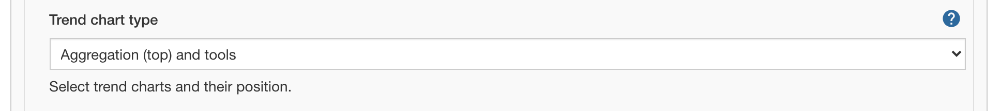

- `AGGREGATION_TOOLS`: The aggregation trend is shown **before** all other analysis tool trend charts.
- `TOOLS_AGGREGATION`: The aggregation trend is shown **after** all other analysis tool trend charts.
- `TOOLS_ONLY`: The aggregation trend is not shown, only the analysis tool trend charts are shown.
- `AGGREGATION_ONLY`: The aggregation trend is only shown, no other analysis tool trend charts are shown.
- `NONE`: Neither the aggregation trend nor analysis tool trend charts are shown. 

In the details page you can cycle through the available charts by using the carousel control. The following different trend chart types are currently available:

#### Distribution of issues by severity

The default trend chart shows the total number of issues, stacked by severity. Using this chart you see which severity
contributes the most to the total number of issues. 


 
#### Issues per static analysis type

If your are aggregating the results of several static analysis results, the type chart shows the number of issues for
each of the tools using an individual line. You can temporarily hide tools by clicking on the corresponding 
legend symbol.   

 

#### New vs. Fixed issues

If you are interested in your backlog on issues you can open the new-versus-fixed chart. It maps issues 
introduced versus issues fixed over a sequence of builds. This helps you understand whether your overall backlog 
is growing or shrinking.

 

#### Health of the project

The health chart is only available if health reporting has been enabled. In this case, the trend chart shows how many 
warnings are in the healthy and unhealthy regions. Your project goal should be to let the number of warnings not 
escape the green part of the chart.  

 

#### Zooming

All trend charts in the detail views support zooming of the build axis using the range sliders at the bottom of the chart. 

 
 
#### Build vs. Date Axis

All trend charts in the detail views can show the number of warnings per build or per day. You can switch between this 
X-axis variants by selecting the corresponding icon in the top right corner. Each day shows the average number of 
warnings. 

 
 
### Issues overview

You can get a fast and efficient overview of the reported set of issues in several aggregation views. 
Depending on the number or type of issues you will see the distribution of issues by
- Static Analysis Tool
- Module
- Package or Namespace
- Severity
- Category
- Type

Each of these detail views are interactive, i.e. you can navigate into a subset of the categorized issues. 

 

### Issues details

The set of reported issues is shown in a modern and responsive table. The table is loaded on demand using an Ajax 
call. It provides the following features:

- **Pagination**: the number of issues is subdivided into several pages which can be selected by using the provided page 
links. Note that currently the pagination is done on the client side, i.e. it may take some time to obtain the whole table of 
issues from the server.
- **Sorting**: the table content can be sorted by clicking on ony of the table columns.
- **Filtering, Searching**: you can filter the shown issues by entering some text in the search box.
- **Content Aware**: columns are only shown if there is something useful to display. I.e., if a tool does not report an
issues category, then the category will be automatically hidden.
- **Responsive**: the layout should adapt to the actual screen threshold. 
- **Details**: the details message for an issue (if provided by the corresponding static analysis tool) is shown as 
child row within the table.

 

### Source code blames (for Git projects)

:warning: This feature requires the installation of an additional plugin: 
[Git Forensics Plugin](https://github.com/jenkinsci/git-forensics-plugin).

If not disabled in the job configuration, the plugin will execute `git blame` to determine who is the responsible 
'author' of an issue. In the corresponding *SCM Blames* view all issues will be listed with author name, email and
commit ID. If available by the corresponding SCM plugin, you can also directly navigate to the affected commit using
the configured repository browser.
  
 

In order to disable the blame feature, set the property `skipBlames` to `true`, see the following example:
```groovy
recordIssues skipBlames: true, tool: java(pattern: '*.log')
```

### Repository forensics (for Git projects)

:warning: This feature requires the installation of an additional plugin: 
[Git Forensics Plugin](https://github.com/jenkinsci/git-forensics-plugin).

If the Git Forensics plugin has been configured to mine the source code repository in the style of Code as a Crime Scene (Adam Tornhill, November 2013) then this information will be shown in an additional view side by side with the issues.
In this *SCM Forensics* view all issues will be listed with the following properties of the affected files:
- commits count
- different authors count
- creation time
- last modification time
- lines of code (from the commit details)
- code churn (changed lines since created)
  
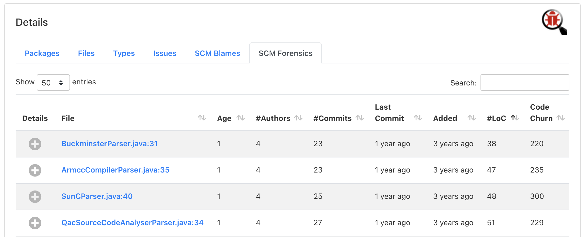 

If a project contains many issues, then this view will give you a hint, which files you should improve first. Files
that have many lines, many changed lines, many different authors, or many commits are frequently touched in your project
and typically require a special attention.  

### Source code view

The source code view now uses the JS library [Prism](https://prismjs.com) to show warnings in an affected file. 
This library provides syntax highlighting for the most popular languages and renders everything on the client side.


### Issues Totals Column

You can show the total number of issues of a job in separate columns of the Jenkins jobs table. By default, the Jenkins
main list view will show a new column that counts the total number of issues of all tools. You can add additional columns
that can configure
- the column name 
- the actual tools that should be taken into account
- the type of the totals to show (overall warnings, new warnings, specific severity, etc.), see section 
[Token Macro Support](#token-macro-support).

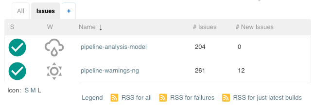

### Dashboard view support

Support for Jenkins [dashboard view](https://wiki.jenkins.io/display/JENKINS/Dashboard+View) is also available.
Currently, the following portlets are available:

#### Issues per tool and job table

An issues table shows the total number of issues for a job (separated by each tool). 
 


#### Issues trend

A trend chart can be added as portlet that shows an aggregation of the total number of issues of all jobs.

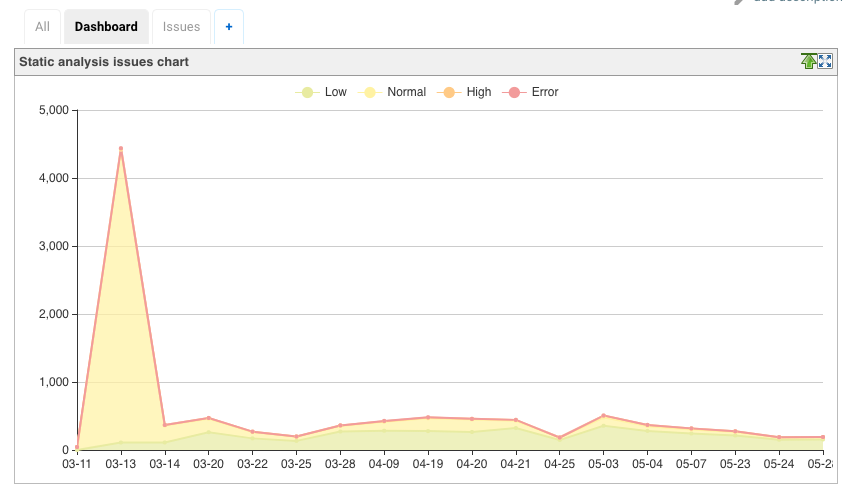

### Remote API

The plugin provides the following REST API endpoints. 

#### Aggregation summary of all analysis results

All static analysis tools that have been configured in a build can be queried by using the URL 
`[build-url]/warnings-ng/api/json` (or `[build-url]/warnings-ng/api/xml`). This aggregation shows ID, name, URL and 
total number of issues, and breakdown of issue count by severity for each tool.

```json
{
  "_class": "io.jenkins.plugins.analysis.core.restapi.AggregationApi",
  "tools": [
    {
      "id": "maven",
      "latestUrl": "http://localhost:8080/view/White%20Mountains/job/New%20-%20Pipeline%20-%20Simple%20Model/26/maven",
      "name": "Maven Warnings",
      "size": 9,
      "errorSize": 0,
      "highSize": 6,
      "normalSize": 1,
      "lowSize": 2
    },
    {
      "id": "java",
      "latestUrl": "http://localhost:8080/view/White%20Mountains/job/New%20-%20Pipeline%20-%20Simple%20Model/26/java",
      "name": "Java Warnings",
      "size": 1,
      "errorSize": 1,
      "highSize": 0,
      "normalSize": 0, 
      "lowSize": 0
    },
    {
      "id": "javadoc",
      "latestUrl": "http://localhost:8080/view/White%20Mountains/job/New%20-%20Pipeline%20-%20Simple%20Model/26/javadoc",
      "name": "JavaDoc Warnings",
      "size": 0,
      "errorSize": 0,
      "highSize": 0,
      "normalSize": 0,
      "lowSize": 0
    },
    {
      "id": "checkstyle",
      "latestUrl": "http://localhost:8080/view/White%20Mountains/job/New%20-%20Pipeline%20-%20Simple%20Model/26/checkstyle",
      "name": "CheckStyle Warnings",
      "size": 0,
      "errorSize": 0,
      "highSize": 0,
      "normalSize": 0,
      "lowSize": 0
    },
    {
      "id": "pmd",
      "latestUrl": "http://localhost:8080/view/White%20Mountains/job/New%20-%20Pipeline%20-%20Simple%20Model/26/pmd",
      "name": "PMD Warnings",
      "size": 671,
      "errorSize": 0,
      "highSize": 1,
      "normalSize": 70,
      "lowSize": 600
    },
    {
      "id": "spotbugs",
      "latestUrl": "http://localhost:8080/view/White%20Mountains/job/New%20-%20Pipeline%20-%20Simple%20Model/26/spotbugs",
      "name": "SpotBugs Warnings",
      "size": 0,
      "errorSize": 0,
      "highSize": 0,
      "normalSize": 0,
      "lowSize": 0
    },
    {
      "id": "cpd",
      "latestUrl": "http://localhost:8080/view/White%20Mountains/job/New%20-%20Pipeline%20-%20Simple%20Model/26/cpd",
      "name": "CPD Warnings",
      "size": 123,
      "errorSize": 0,
      "highSize": 0,
      "normalSize": 23,
      "lowSize": 100
    },
    {
      "id": "open-tasks",
      "latestUrl": "http://localhost:8080/view/White%20Mountains/job/New%20-%20Pipeline%20-%20Simple%20Model/26/open-tasks",
      "name": "Open Tasks Scanner Warnings",
      "size": 11,
      "errorSize": 0,
      "highSize": 0,
      "normalSize": 11,
      "lowSize": 0
    }
  ]
}
```

#### Summary of the analysis result

You can obtain a summary of a particular analysis report by using the URL `[build-url]/[tool-id]/api/xml` 
(or `[build-url]/[tool-id]/api/json`). The summary contains the number of issues, the quality gate status, and all 
info and error messages.

Here is an example XML report:

```xml
<analysisResultApi _class='io.jenkins.plugins.analysis.core.restapi.AnalysisResultApi'>
  <totalSize>3</totalSize>
  <fixedSize>0</fixedSize>
  <newSize>0</newSize>
  <noIssuesSinceBuild>-1</noIssuesSinceBuild>
  <successfulSinceBuild>-1</successfulSinceBuild>
  <qualityGateStatus>WARNING</qualityGateStatus>
  <owner _class='org.jenkinsci.plugins.workflow.job.WorkflowRun'>
    <number>46</number>
    <url>http://localhost:8080/view/White%20Mountains/job/Full%20Analysis%20-%20Model/46/</url>
  </owner>
  <infoMessage>Searching for all files in '/tmp/node1/workspace/Full Analysis - Model' that match the pattern
    '**/target/spotbugsXml.xml'
  </infoMessage>
  <infoMessage>-> found 1 file</infoMessage>
  <infoMessage>Successfully parsed file /tmp/node1/workspace/Full Analysis - Model/target/spotbugsXml.xml</infoMessage>
  <infoMessage>-> found 3 issues (skipped 0 duplicates)</infoMessage>
  <infoMessage>Post processing issues on 'node1' with encoding 'UTF-8'</infoMessage>
  <infoMessage>Resolving absolute file names for all issues</infoMessage>
  <infoMessage>-> affected files for all issues already have absolute paths</infoMessage>
  <infoMessage>Copying affected files to Jenkins' build folder /Users/hafner/Development/jenkins/jobs/Full Analysis -
    Model/builds/46
  </infoMessage>
  <infoMessage>-> 2 copied, 0 not in workspace, 0 not-found, 0 with I/O error</infoMessage>
  <infoMessage>Resolving module names from module definitions (build.xml, pom.xml, or Manifest.mf files)</infoMessage>
  <infoMessage>-> all issues already have a valid module name</infoMessage>
  <infoMessage>Resolving package names (or namespaces) by parsing the affected files</infoMessage>
  <infoMessage>-> all affected files already have a valid package name</infoMessage>
  <infoMessage>Creating fingerprints for all affected code blocks to track issues over different builds</infoMessage>
  <infoMessage>No filter has been set, publishing all 3 issues</infoMessage>
  <infoMessage>No valid reference build found - all reported issues will be considered outstanding</infoMessage>
  <infoMessage>Evaluating quality qualityGates</infoMessage>
  <infoMessage>-> WARNING - Total number of issues: 3 - Quality Gate: 1</infoMessage>
  <infoMessage>-> Some quality qualityGates have been missed: overall result is WARNING</infoMessage>
  <infoMessage>Health report is disabled - skipping</infoMessage>
</analysisResultApi>
```

#### Details of the analysis result

The reported issues are also available as REST API. You can either query all issues or only the 
new, fixed, or outstanding issues. The corresponding URLs are:

1. `[build-url]/[tool-id]/all/api/xml`: lists all issues
2. `[build-url]/[tool-id]/fixed/api/xml`: lists all fixed issues
3. `[build-url]/[tool-id]/new/api/xml`: lists all new issues
4. `[build-url]/[tool-id]/outstanding/api/xml`: lists all outstanding issues

Here is an example JSON report:

```json
{
  "_class" : "io.jenkins.plugins.analysis.core.restapi.ReportApi",
  "issues" : [
    {
      "baseName" : "AbstractParser.java",
      "category" : "EXPERIMENTAL",
      "columnEnd" : 0,
      "columnStart" : 0,
      "description" : "",
      "fileName" : "/private/tmp/node1/workspace/Full Analysis - Model/src/main/java/edu/hm/hafner/analysis/AbstractParser.java",
      "fingerprint" : "be18f803030f2af690fbeef09eafa5c9",
      "lineEnd" : 59,
      "lineStart" : 59,
      "message" : "edu.hm.hafner.analysis.AbstractParser.parse(File, Charset, Function) may fail to clean up java.io.InputStream",
      "moduleName" : "Static Analysis Model and Parsers",
      "origin" : "spotbugs",
      "packageName" : "edu.hm.hafner.analysis",
      "reference" : "46",
      "severity" : "LOW",
      "type" : "OBL_UNSATISFIED_OBLIGATION"
    },
    {
      "baseName" : "ReportTest.java",
      "category" : "STYLE",
      "columnEnd" : 0,
      "columnStart" : 0,
      "description" : "",
      "fileName" : "/private/tmp/node1/workspace/Full Analysis - Model/src/test/java/edu/hm/hafner/analysis/ReportTest.java",
      "fingerprint" : "331d509297fad027813365ad0fb37e69",
      "lineEnd" : 621,
      "lineStart" : 621,
      "message" : "Return value of Report.get(int) ignored, but method has no side effect",
      "moduleName" : "Static Analysis Model and Parsers",
      "origin" : "spotbugs",
      "packageName" : "edu.hm.hafner.analysis",
      "reference" : "46",
      "severity" : "LOW",
      "type" : "RV_RETURN_VALUE_IGNORED_NO_SIDE_EFFECT"
    },
    {
      "baseName" : "ReportTest.java",
      "category" : "STYLE",
      "columnEnd" : 0,
      "columnStart" : 0,
      "description" : "",
      "fileName" : "/private/tmp/node1/workspace/Full Analysis - Model/src/test/java/edu/hm/hafner/analysis/ReportTest.java",
      "fingerprint" : "1e641f9c0b35ed97140d639695e8ce18",
      "lineEnd" : 624,
      "lineStart" : 624,
      "message" : "Return value of Report.get(int) ignored, but method has no side effect",
      "moduleName" : "Static Analysis Model and Parsers",
      "origin" : "spotbugs",
      "packageName" : "edu.hm.hafner.analysis",
      "reference" : "46",
      "severity" : "LOW",
      "type" : "RV_RETURN_VALUE_IGNORED_NO_SIDE_EFFECT"
    }
  ],
  "threshold" : 3
}
```

### Token macro support

The Warnings plugin provides the token `ANALYSIS_ISSUES_COUNT` that could be used in additional post build processing
steps, e.g. in the mailer. In order to use this token you need to install the 
[Token Macro plugin](https://plugins.jenkins.io/token-macro). 
The token has the following optional parameters:
- `tool`: selects a particular analysis result, if not defined all results are summed up
- `type`: selects the type of the counter to use, choose one of:
  - `TOTAL` - Total (any severity), this is the default 
  - `TOTAL_ERROR` - Total (errors only)
  - `TOTAL_HIGH` - Total (severity high only)
  - `TOTAL_NORMAL` - Total (severity normal only)
  - `TOTAL_LOW` - Total (severity low only)
  - `NEW` - New (any severity)
  - `NEW_ERROR` - New (errors only)
  - `NEW_HIGH` - New (severity high only)
  - `NEW_NORMAL` - New (severity normal only)
  - `NEW_LOW` - New (severity low only)
  - `DELTA` - Delta (any severity)
  - `DELTA_ERROR` - Delta (errors only)
  - `DELTA_HIGH` - Delta (severity high only)
  - `DELTA_NORMAL` - Delta (severity normal only)
  - `DELTA_LOW` - Delta (severity low only)
  - `FIXED` - Fixed (any severity)

Examples:

- `${ANALYSIS_ISSUES_COUNT}`: expands to the aggregated number of issues of all analysis tools
- `${ANALYSIS_ISSUES_COUNT, tool="checkstyle"}`: expands to the total number of **CheckStyle** issues
- `${ANALYSIS_ISSUES_COUNT, tool="checkstyle", type="NEW"}`: expands to the number of new **CheckStyle** issues

### Warnings Checks (for GitHub projects)

:warning: This feature requires:
* the installation of an additional plugin: [GitHub Checks Plugin](https://github.com/jenkinsci/github-checks-plugin)
* the configuration of GitHub App credentials, see [this guide](https://github.com/jenkinsci/github-branch-source-plugin/blob/master/docs/github-app.adoc) for more details

If not disabled in the job configuration, this plugin will publish warnings to GitHub through 
[GitHub checks API](https://docs.github.com/en/rest/reference/checks). It publishes the results of each analysis tool
as an individual check. If a quality gate has been configured, then the result will be published as check result 
(success or failed).

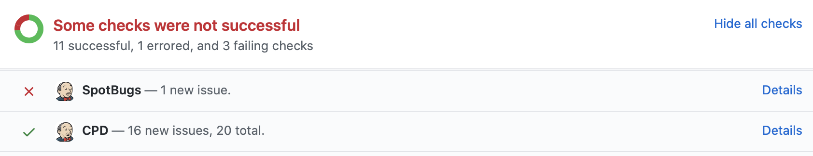

In the *Details* view of each check ([example](https://github.com/jenkinsci/warnings-ng-plugin/pull/593/checks?check_run_id=1026691589)), 
issues statistics will be displayed.

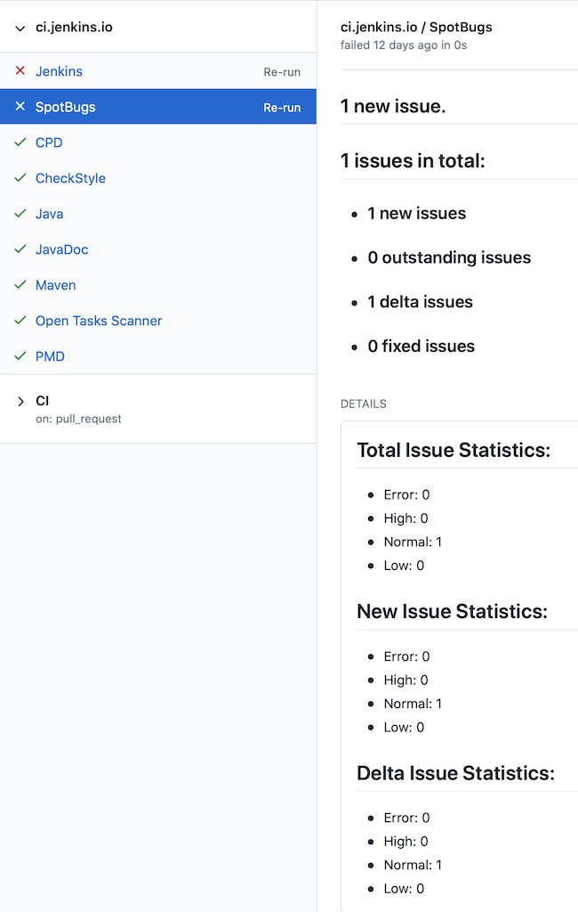

When a new pull request or commit causes new issues, these issues will be added as annotations right below the source
code. You can also choose to show all issues by chaning the property `checksAnnotationScope`. In this case, not only new issues
will be highlighted but also outstanding ones. (Note: GitHub renders annotations only for source
code blocks that have been changed in a commit.)

```groovy
recordIssues checksAnnotationScope: 'ALL', tool: java(pattern: '*.log')
```

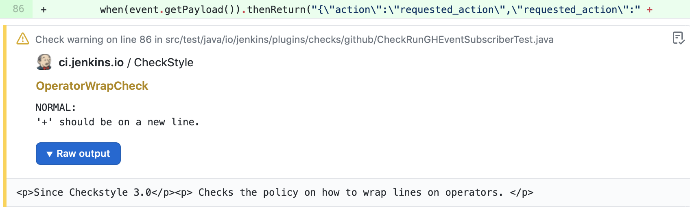

In order to disable the checks feature, set the property `skipPublishingChecks` to `true`:
```groovy
recordIssues skipPublishingChecks: true, tool: java(pattern: '*.log')
```

The publisher will respect a `withChecks` context:
```groovy
withChecks('My Custom Checks Name') {
  recordIssues tool: java(pattern: '*.log')
}
```
