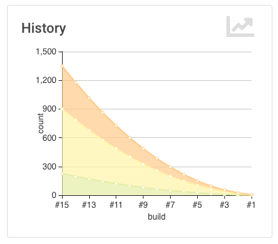

# Jenkins Warning Plug-in

The Jenkins 'warnings' plug-in collects compiler warnings or issues reported by static analysis tools and visualizes the 
results. It has built-in support for numerous static analysis tools (including several compilers), see the list of
[supported report formats](../SUPPORTED-FORMATS.md). 

## Supported Project Types

Starting with release 5.x the warnings plug-in has support for the following Jenkins project types:

- Freestyle Project
- Maven Project
- Matrix Project
- Scripted Pipeline (sequential and parallel steps)
- Declarative Pipeline (sequential and parallel steps)
- Multi-branch Pipeline

## Features Overview 

The warnings plug-in basically provides the following features if added as a post build action (or step) to a job: 

1. The plug-in scans the console log of a Jenkins build or files in the workspace of your job for any kind of issues. 
There are almost one hundred [report formats](../SUPPORTED-FORMATS.md) supported. It can detect errors from you 
compiler (C, C#, Java, etc.), warnings from a static analysis tool (CheckStyle, StyleCop, SpotBugs, etc.),
duplications from a copy-and-paste detector (CPD, Simian, etc.), vulnerabilities, or even open tasks in comments of 
your source files. 
2. The plug-in publishes a report of the found issues in your build, so you can navigate to a summary report from the 
main build page. From here you can also dive into the details: 
    1. distribution of new, fixed and outstanding issues
    2. distribution of the issues by severity, category, type, module, or package
    3. list of all issues including helpful comments from the reporting tool
    4. annotated source code of the affected files
    5. trend charts of the issues 
    
## Transition from 4.x to 5.x

Previously the warnings plug-in was part of the static analysis suite, that provided the same set of features through 
several plugins (CheckStyle, PMD, Static Analysis Utilities, Analysis Collector etc.). 
In order to simplify the user experience and the development process, these
plug-ins and the core functionality have been merged into the warnings plug-ins. All other plug-in are not required
anymore and will not be supported in the future. If you already use one of these plug-ins you should migrate
your jobs to the new API as soon as possible. I will still maintain the old code for a while, but the main development
effort will be spent into the new code base. 

Note: the dependency to the old API (analysis-core) is still required so that all existing
jobs will function correctly. In future versions of the warnings plug-in I will make this dependency optional. 

### Migration of Pipelines

Pipelines calling the old static analysis steps (e.g., `findbugs`, `checkstyle`, etc.) need to call the new `recordIssues` 
step now. The same step is used for all static analysis tools, the actual parser is selected
by using the step property `tools`. For more details on the set of available parameters please see section 
[Configuration](#configuration).     

### Migration of all other jobs

Freestyle, Matrix or Maven Jobs using the old API used a so called **Post Build Action** that was provided by 
each individual plug-in. E.g., the FindBugs plug-in did provide the post build action 
*"Publish FindBugs analysis results"*. These old plug-in specific actions are not supported anymore, 
they are now marked with *\[Deprecated\]* in the user interface. 
Now you need to add a new post build step - this step now is called *"Record static analysis results"*
for all static analysis tools. The selection of the tool is part of the configuration of this post build step. 
Note: the warnings produced by a post build step using the old API cannot not be read by the new post build actions.
I.e., you can't see a combined history of the old and new results - you simply see two unrelated results. There is
also no automatic conversion of results stored in the old format available.

### Migration of Plug-in Depending on analysis-core

The following plug-ins have been integrated into this version of the warnings plug-in:

- Android-Lint Plug-in
- CheckStyle Plug-in
- CCM Plug-in
- Dry Plug-in
- PMD Plug-in
- FindBugs Plug-in

All other plug-ins still need to be integrated or need to be refactored to use the new API.

## Configuration

The configuration of the plug-in is the same for all Jenkins job types. It is enabled in the UI by adding 
the post build action *"Record static analysis results"* to your job. In pipelines the plug-in will be activated 
by adding the step `recordIssues`. Note that for scripted pipelines some additional features are available to 
aggregate and group issues, see [section Advanced Pipeline Configuration](#advanced-pipeline-configuration) for details. 

In the following sections, both the graphical configuration and the pipeline configuration are shown side by side.
    
### Tool selection

The basic configuration of the plug-in is shown in the image above:

 

First of all you need to specify the tool that should be used to parse the console log or the report file. 
Then you need to specify the pattern of the report files that should be parsed and scanned for issues. 
If you do not specify a pattern, then the console log of your build will be scanned. For several popular tools a default
pattern has been provided. Depending on the selected tool you might configure some additional parameters as well. 
You can specify multiple tools (and patterns) that will be used with the same configuration. Due to a technical 
(or marketing) limitation of Jenkins it is not possible to select different configurations by using multiple post build 
actions.  

One new feature is available by using the checkbox *"Aggregate Results"*: if this option is selected, then one result
is created that contains an aggregation of all issues of the selected tools. This is something the 
Static Analysis Collector Plug-in provided previously. When this option is activated you get a unique entry point 
for all of your issues.

In the basic configuration section you can additionally choose if the step should run for failed builds as well.
This option is disabled by default, since analysis results might be inaccurate if the build failed.
 
An example pipeline with these options is shown in the following snippet:

```
recordIssues 
    enabledForFailure: true, aggregatingResults : true, 
    tools: [
        [tool: [$class: 'Java']], 
        [pattern: 'checkstyle-result.xml', tool: [$class: 'CheckStyle']]
    ]
```

#### Setting the file encoding

In order to let the scanner parse correctly your reports and source code files it is required to set the encodings: 

 

An example pipeline with these options is shown in the following snippet:

```
recordIssues 
    sourceCodeEncoding: 'UTF-8', reportEncoding : 'ISO-8859-1', tools: [[tool: [$class: 'Java']]]
```

#### Control the selection of the reference build (baseline)

One important feature of the warnings plug-in is the classification of issues as new, outstanding and fixed:
- **new**: all issues, that are part of the current report but have not been shown up in the reference report
- **fixed**: all issues, that are part of the reference report but are not present in the current report anymore
- **outstanding**: all issues, that are part of the current and reference report

In order to compute this classification, the plug-in requires a reference build (baseline). New, fixed, and outstanding
issues are then computed by comparing the issues in the current build and the baseline. There are three options that
control the selection of the reference build. 

 

An example pipeline with these options is shown in the following snippet:

```
recordIssues 
    tools: [ [tool: [$class: 'Java']] ],
    ignoreAnalysisResult: true, overallResultMustBeSuccess: false, referenceJobName: 'my-project/master'
```

#### Filtering of issues

The created report of issues can be filtered afterwards. You can specify an arbitrary number of include or exclude 
filters. Currently, there is support to filter issues by module name, package or namespace name, file name, 
category or type.

 

An example pipeline with these options is shown in the following snippet:

```
recordIssues 
    tools: [[pattern: '*.log', tool: [$class: 'Java']]], 
    filters: [includeFile('MyFile.*.java'), excludeCategory('WHITESPACE')]
```

#### Quality gate configuration

You can define several quality gates that will be checked after the issues have been reported. These quality gates
help you to modify Jenkins' build status so that you immediately see if the desired quality of your product is met. 
A build can be set to **unstable** or **failed** for each of these quality gates. All quality gates use a simple metric:
you can define the number of issues that must not be reached to pass a given quality gate.   

 

An example pipeline with these options is shown in the following snippet:

```
recordIssues 
    tools: [[pattern: '*.log', tool: [$class: 'Java']]], unstableTotalHigh: 10, unstableNewAll: 1
```

#### Health Report configuration

The plug-in can participate in the health report of your project. You can change the number of issues
that change the health to 0% and 100%, respectively. Additionally, the severities that should be considered
when creating the health report can be selected.
 
 

An example pipeline with these options is shown in the following snippet:

```
recordIssues 
    tools: [[pattern: '*.log', tool: [$class: 'Java']]], healthy: 10, unhealthy: 100
```

### Pipeline Configuration

Pipelines can create static analysis reports using two different approaches. The simple configuration
basically provides the same properties as the post build action (see [above](#graphical-configuration)). 

#### Simple Pipeline Configuration 

The simple pipeline configuration is provided by the step `recordIssues`. This step scans for issues
in a given set of files (or in the console log) and reports these issues in your build. You can use the 
snippet generator to create a working snippet that calls this step. A typical example of this step 
is shown in the following example:

```
recordIssues 
    enabledForFailure: true, 
    tools: [[pattern: '*.log', tool: [$class: 'Java']]], 
    filters: [includeFile('MyFile.*.java'), excludeCategory('WHITESPACE')]
```

In this example, the files '*.log' are scanned for **Java** issues. Only issues with a file name matching the 
pattern 'MyFile.\*.java' are included. Issues with category 'WHITESPACE' will be removed. The
step will be executed even if the build failed. 

In order to see all configuration options you can investigate the 
[step implementation](../src/main/java/io/jenkins/plugins/analysis/core/steps/IssuesRecorder.java).
                                              
#### Advanced Pipeline Configuration

Sometimes publishing and reporting issues using a single step is not sufficient. E.g., if you build your
product using several parallel steps and you want to combine the issues from all of these steps into 
a single result. Then you need to split scanning and aggregation. The plug-in provides the following
two steps:
- `scanForIssues`: this step scans a report file or the console log with a particular parser and creates an 
  intermediate 
  [Report](https://github.com/jenkinsci/analysis-model/blob/master/src/main/java/edu/hm/hafner/analysis/Report.java) 
  object that contains the report. See 
  [step implementation](../src/main/java/io/jenkins/plugins/analysis/core/steps/ScanForIssuesStep.java) for details.
- `publishIssues`: this step publishes a new report in your build that contains the aggregated results
  of several `scanForIssues` steps. See 
  [step implementation](../src/main/java/io/jenkins/plugins/analysis/core/steps/PublishIssuesStep.java) for details.

Example: 
```
node {
    stage ('Checkout') {
        git branch:'5.0', url: 'git@github.com:jenkinsci/warnings-plugin.git'
    }
    stage ('Build') {
        def mvnHome = tool 'mvn-default'

        sh "${mvnHome}/bin/mvn --batch-mode -V -U -e clean verify -Dsurefire.useFile=false"

        junit testResults: '**/target/*-reports/TEST-*.xml'

        def java = scanForIssues tool: [$class: 'Java']
        def javadoc = scanForIssues tool: [$class: 'JavaDoc']
        
        publishIssues issues:[java, javadoc], 
            filters:[includePackage('io.jenkins.plugins.analysis.*')]
    }

    stage ('Analysis') {
        def mvnHome = tool 'mvn-default'

        sh "${mvnHome}/bin/mvn -batch-mode -V -U -e checkstyle:checkstyle pmd:pmd pmd:cpd findbugs:findbugs"

        def checkstyle = scanForIssues tool: [$class: 'CheckStyle'], pattern: '**/target/checkstyle-result.xml'
        publishIssues issues:[checkstyle]
   
        def pmd = scanForIssues tool: [$class: 'Pmd'], pattern: '**/target/pmd.xml'
        publishIssues issues:[pmd]
        
        def cpd = scanForIssues tool: [$class: 'Cpd'], pattern: '**/target/cpd.xml'
        publishIssues issues:[cpd]
        
        def findbugs = scanForIssues tool: [$class: 'FindBugs'], pattern: '**/target/findbugsXml.xml'
        publishIssues issues:[findbugs]

        def maven = scanForIssues tool: [$class: 'MavenConsole']
        publishIssues issues:[maven]
        
        publishIssues id:'analysis', name:'White Mountains Issues', 
            issues:[checkstyle, pmd, findbugs], 
            filters:[includePackage('io.jenkins.plugins.analysis.*')]
    }

``` 
  
## New Features

The most important new features are described in the following sections. 

### Issues history: new, fixed, and outstanding issues

A highlight of the plug-in is the possibility to categorize issues of subsequent builds as new, fixed and outstanding.

 

Using this feature it makes it a lot easier to keep the quality of your project under control: you can focus
only on those warnings that have been introduced recently. 

Note: the detection of new warnings is based on a complex algorithm that tries to track the same warning in
two two different versions of the source code. Depending on the extend of the modification of the source code
it might produce some false positives, i.e., you might still get some new and fixed warnings even if there should 
be none. The accuracy of this algorithm is still ongoing research and will be refined in the next couple of months. 

### Severities

The plug-in shows the distribution of the severities of the issues in a chart. It defines the 
following default severities, additional ones might be added by plug-ins that extend the warnings plug-in. 
Note that not every parser is capable of producing warnings with a different severity. Some of the parses simply 
use the same severity for all issues.
- **Error**: Indicates an error that typically fails the build
- **Warning** (High, Normal, Low): Indicates a warning of the given priority. Mapping to the priorities
is up to the individual parsers.

 

### Build Trend

In order to see the trend of the analysis results, a chart showing the number of issues per build is also
shown. This chart is used in the details page as well as in the job overview. Currently, type and configuration
of the chart is fixed. This will be enhanced in future versions of the plug-in.

 

### Issues Overview

You can get a fast and efficient overview of the reported set of issues in several aggregation views. 
Depending on the number or type of issues you will see the distribution of issues by
- Static Analysis Tool
- Module
- Package or Namespace
- Severity
- Category
- Type

Each of these detail views are interactive, i.e. you can navigate into a subset of the categorized issues. 

 

### Issues Details

The reported set of issues is shown in a modern and responsive table. The table is loaded on demand using an Ajax 
call. It provides the following features:
- **Pagination**: the number of issues is subdivided into several pages which can be selected by using the provided page 
links. Note that currently the pagination is done on the client side, i.e. it may take some time to obtain the whole table of 
issues from the server.
- **Sorting**: the table content can be sorted by clicking on ony of the table columns.
- **Filtering, Searching**: you can filter the shown issues by entering some text in the search box.
- **Content Aware**: columns are only shown if there is something useful to display. I.e., if a tool does not report an
issues category, then the category will be automatically hidden.
- **Responsive**: the layout should adapt to the actual screen size. 
- **Details**: the details message for an issue (if provided by the corresponding static analysis tool) is shown as 
child row within the table.

 

### Source Code View

TBD.

### Remote API

The plug-in provides two REST API endpoints. 

#### Summary of the analysis result

You can obtain a summary of a particular analysis report by using the URL `\[tool-id\]/api/xml` 
(or `\[tool-id\]/api/json`). The summary contains the number of issues, the quality gate status, and all 
info and error messages.

Here is an example XML report:

```xml
<analysisResultApi _class='io.jenkins.plugins.analysis.core.restapi.AnalysisResultApi'>
  <totalSize>3</totalSize>
  <fixedSize>0</fixedSize>
  <newSize>0</newSize>
  <noIssuesSinceBuild>-1</noIssuesSinceBuild>
  <successfulSinceBuild>-1</successfulSinceBuild>
  <qualityGateStatus>WARNING</qualityGateStatus>
  <owner _class='org.jenkinsci.plugins.workflow.job.WorkflowRun'>
    <number>46</number>
    <url>http://localhost:8080/view/White%20Mountains/job/Full%20Analysis%20-%20Model/46/</url>
  </owner>
  <infoMessage>Searching for all files in '/tmp/node1/workspace/Full Analysis - Model' that match the pattern
    '**/target/spotbugsXml.xml'
  </infoMessage>
  <infoMessage>-> found 1 file</infoMessage>
  <infoMessage>Successfully parsed file /tmp/node1/workspace/Full Analysis - Model/target/spotbugsXml.xml</infoMessage>
  <infoMessage>-> found 3 issues (skipped 0 duplicates)</infoMessage>
  <infoMessage>Post processing issues on 'node1' with encoding 'UTF-8'</infoMessage>
  <infoMessage>Resolving absolute file names for all issues</infoMessage>
  <infoMessage>-> affected files for all issues already have absolute paths</infoMessage>
  <infoMessage>Copying affected files to Jenkins' build folder /Users/hafner/Development/jenkins/jobs/Full Analysis -
    Model/builds/46
  </infoMessage>
  <infoMessage>-> 2 copied, 0 not in workspace, 0 not-found, 0 with I/O error</infoMessage>
  <infoMessage>Resolving module names from module definitions (build.xml, pom.xml, or Manifest.mf files)</infoMessage>
  <infoMessage>-> all issues already have a valid module name</infoMessage>
  <infoMessage>Resolving package names (or namespaces) by parsing the affected files</infoMessage>
  <infoMessage>-> all affected files already have a valid package name</infoMessage>
  <infoMessage>Creating fingerprints for all affected code blocks to track issues over different builds</infoMessage>
  <infoMessage>No filter has been set, publishing all 3 issues</infoMessage>
  <infoMessage>No valid reference build found - all reported issues will be considered outstanding</infoMessage>
  <infoMessage>Evaluating quality gates</infoMessage>
  <infoMessage>-> WARNING - Total number of issues: 3 - Quality Gate: 1</infoMessage>
  <infoMessage>-> Some quality gates have been missed: overall result is WARNING</infoMessage>
  <infoMessage>Health report is disabled - skipping</infoMessage>
</analysisResultApi>
```

#### Details of the analysis result

The reported issues are also available as REST API. You can either query all issues or only the 
new, fixed, or outstanding issues. The corresponding URLs are:

1. `\[tool-id\]/all/api/xml`: lists all issues
2. `\[tool-id\]/fixed/api/xml`: lists all fixed issues
3. `\[tool-id\]/new/api/xml`: lists all new issues
4. `\[tool-id\]/outstanding/api/xml`: lists all outstanding issues

Here is an example JSON report:

```json
{
  "_class" : "io.jenkins.plugins.analysis.core.restapi.ReportApi",
  "issues" : [
    {
      "baseName" : "AbstractParser.java",
      "category" : "EXPERIMENTAL",
      "columnEnd" : 0,
      "columnStart" : 0,
      "description" : "",
      "fileName" : "/private/tmp/node1/workspace/Full Analysis - Model/src/main/java/edu/hm/hafner/analysis/AbstractParser.java",
      "fingerprint" : "be18f803030f2af690fbeef09eafa5c9",
      "lineEnd" : 59,
      "lineStart" : 59,
      "message" : "edu.hm.hafner.analysis.AbstractParser.parse(File, Charset, Function) may fail to clean up java.io.InputStream",
      "moduleName" : "Static Analysis Model and Parsers",
      "origin" : "spotbugs",
      "packageName" : "edu.hm.hafner.analysis",
      "reference" : "46",
      "severity" : "LOW",
      "type" : "OBL_UNSATISFIED_OBLIGATION"
    },
    {
      "baseName" : "ReportTest.java",
      "category" : "STYLE",
      "columnEnd" : 0,
      "columnStart" : 0,
      "description" : "",
      "fileName" : "/private/tmp/node1/workspace/Full Analysis - Model/src/test/java/edu/hm/hafner/analysis/ReportTest.java",
      "fingerprint" : "331d509297fad027813365ad0fb37e69",
      "lineEnd" : 621,
      "lineStart" : 621,
      "message" : "Return value of Report.get(int) ignored, but method has no side effect",
      "moduleName" : "Static Analysis Model and Parsers",
      "origin" : "spotbugs",
      "packageName" : "edu.hm.hafner.analysis",
      "reference" : "46",
      "severity" : "LOW",
      "type" : "RV_RETURN_VALUE_IGNORED_NO_SIDE_EFFECT"
    },
    {
      "baseName" : "ReportTest.java",
      "category" : "STYLE",
      "columnEnd" : 0,
      "columnStart" : 0,
      "description" : "",
      "fileName" : "/private/tmp/node1/workspace/Full Analysis - Model/src/test/java/edu/hm/hafner/analysis/ReportTest.java",
      "fingerprint" : "1e641f9c0b35ed97140d639695e8ce18",
      "lineEnd" : 624,
      "lineStart" : 624,
      "message" : "Return value of Report.get(int) ignored, but method has no side effect",
      "moduleName" : "Static Analysis Model and Parsers",
      "origin" : "spotbugs",
      "packageName" : "edu.hm.hafner.analysis",
      "reference" : "46",
      "severity" : "LOW",
      "type" : "RV_RETURN_VALUE_IGNORED_NO_SIDE_EFFECT"
    }
  ],
  "size" : 3
}
```

### Token Macro Support

The warnings plug-in provides the token `ANALYSIS_ISSUES_COUNT` that could be used in additional post build processing
steps, e.g. in the mailer. In order to use this tokens you need to install the latest release of the 
[token macro plug-in](https://wiki.jenkins.io/display/JENKINS/Token+Macro+Plugin). 
The token has an optional parameter `tool` that could be used to select a particular analysis result. 
Examples:
- `${ANALYSIS_ISSUES_COUNT}`: expands to the aggregated number of issues of all analysis tools
- `${ANALYSIS_ISSUES_COUNT, tool='checkstyle'}`: expands to the total number of **CheckStyle** issues

### Trend Reports

Several trend reports are available that show a historical trend of the issues. These trends will be modernized as well 
in the near future.

## Not Yet Supported Features

Some of the existing features of the warnings plug-in are not yet ported to the API. These will be added one by one after the
first 5.x release of the warnings plug-in: 
- Visualization of open tasks
- Portlets for Jenkins' dashboard view
- View column that shows the number of issues in a job
- Quality gate based on the total number of issues


