# Jenkins Warnings Next Generation Plugin

The Jenkins Warnings Next Generation Plugin collects compiler warnings or issues reported by static analysis tools and visualizes the 
results. It has built-in support for numerous static analysis tools (including several compilers), see the list of
[supported report formats](../SUPPORTED-FORMATS.md). 

## Supported project types

The Warnings Next Generation plugin has support for the following Jenkins project types:

- Freestyle Project
- Maven Project
- Matrix Project
- Scripted Pipeline (sequential and parallel steps)
- Declarative Pipeline (sequential and parallel steps)
- Multi-branch Pipeline

## Features overview 

The Warnings Next Generation Plugin provides the following features when added as a post build action (or step) to a job: 

1. The plugin scans the console log of a Jenkins build or files in the workspace of your job for any kind of issues. 
There are almost one hundred [report formats](../SUPPORTED-FORMATS.md) supported. Among the problems it can detect:
    - errors from your compiler (C, C#, Java, etc.)
    - warnings from a static analysis tool (CheckStyle, StyleCop, SpotBugs, etc.)
    - duplications from a copy-and-paste detector (CPD, Simian, etc.)
    - vulnerabilities
    - open tasks in comments of your source files
2. The plugin publishes a report of the issues found in your build, so you can navigate to a summary report from the 
main build page. From there you can also dive into the details: 
    - distribution of new, fixed and outstanding issues
    - distribution of the issues by severity, category, type, module, or package
    - list of all issues including helpful comments from the reporting tool
    - annotated source code of the affected files
    - trend charts of the issues 
    
## Table of Contents

  * [Configuration](#configuration)
     * [Tool selection](#tool-selection)
     * [Creating support for a custom tool](#creating-support-for-a-custom-tool)
        * [Deploying a new tool using a custom plugin](#deploying-a-new-tool-using-a-custom-plugin)
        * [Creating a new tool using a Groovy parser](#creating-a-new-tool-using-a-groovy-parser)
            * [Creating a Groovy parser programmatically](#creating-a-groovy-parser-programmatically)
        * [Using the defined tool](#using-the-defined-tool)
     * [Setting the source code file encoding](#setting-the-source-code-file-encoding)
     * [Control the selection of the reference build (baseline)](#control-the-selection-of-the-reference-build-baseline)
     * [Filtering issues](#filtering-issues)
     * [Quality gate configuration](#quality-gate-configuration)
     * [Health report configuration](#health-report-configuration)
     * [Pipeline configuration](#pipeline-configuration)
        * [Simple Pipeline configuration](#simple-pipeline-configuration)
        * [Declarative Pipeline configuration](#declarative-pipeline-configuration)
        * [Advanced Pipeline configuration](#advanced-pipeline-configuration)
  * [New features](#new-features)
     * [Issues history: new, fixed, and outstanding issues](#issues-history-new-fixed-and-outstanding-issues)
     * [Severities](#severities)
     * [Build trend](#build-trend)
     * [Issues overview](#issues-overview)
     * [Issues details](#issues-details)
     * [Source code blames (for Git projects)](#source-code-blames-for-git-projects)
     * [Source code view](#source-code-view)
     * [Dashboard view support](#dashboard-view-support)
     * [Configuration as code support](#configuration-as-code-support)
     * [Remote API](#remote-api)
        * [Aggregation summary of all analysis results](#aggregation-summary-of-all-analysis-results)
        * [Summary of the analysis result](#summary-of-the-analysis-result)
        * [Details of the analysis result](#details-of-the-analysis-result)
     * [Token macro support](#token-macro-support)
  * [Transition from the static analysis suite](#transition-from-the-static-analysis-suite)
     * [Migration of Pipelines](#migration-of-pipelines)
     * [Migration of all other jobs](#migration-of-all-other-jobs)
     * [Migration of plugins depending on analysis-core](#migration-of-plugins-depending-on-analysis-core)

Created by [gh-md-toc](https://github.com/ekalinin/github-markdown-toc)

# Configuration

The configuration of the plugin is the same for all Jenkins job types. It is enabled in the UI by adding 
the post build action *"Record compiler warnings and static analysis results"* to your job. In pipelines the plugin will be activated 
by adding the step `recordIssues`. Note that for scripted pipelines some additional features are available to 
aggregate and group issues, see [section Advanced Pipeline Configuration](#advanced-pipeline-configuration) for details. 

In the following sections, both the graphical configuration and the pipeline configuration are shown side by side.
    
### Tool selection

The basic configuration of the plugin is shown in the image above:

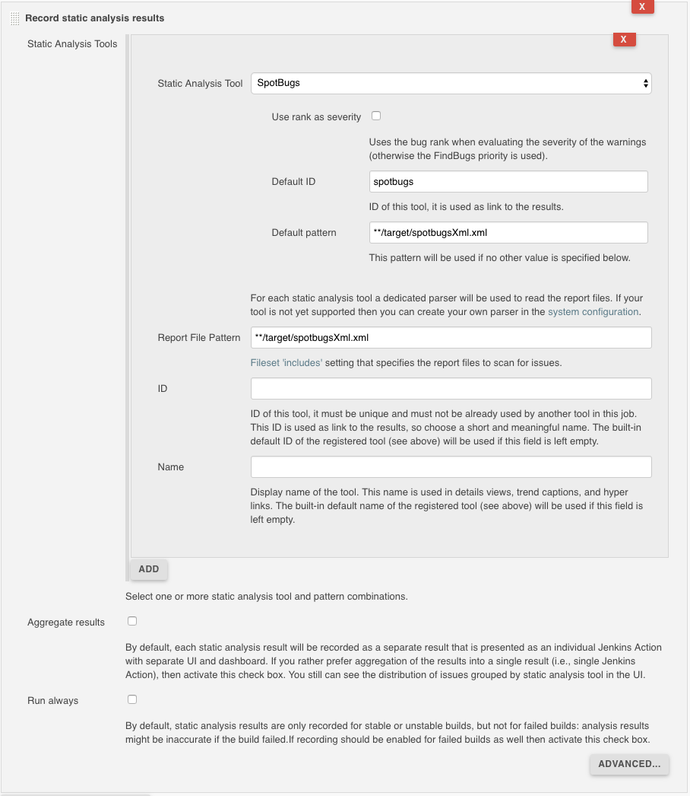 

First of all you need to specify the tool that should be used to create the issues.
Depending on the selected tool you might configure some additional parameters as well. 

For all parsers that read report files you need to specify the pattern of the report files that should be parsed and scanned for issues. 
If you do not specify a pattern, then the console log of your build will be scanned. For several popular tools a default
pattern has been provided: in this case the default pattern will be used if the pattern is empty.  

In order to let the scanner parse correctly your reports it is required to set the encoding of the files, 
otherwise the platform encoding will be used which might be incorrect. 

Each tool is identified by an ID that is used as URL to the results of the analysis. For each tool, a default URL 
(and name) is provided that can be changed if required. E.g., if you are going to use a parser multiple
times then you need to specify different IDs for each of the invocations.  

You can specify multiple tools (and patterns) that will be used with the same configuration. Due to a technical 
(or marketing) limitation of Jenkins it is not possible to select different configurations by using multiple post build 
actions.  

One new feature is available by using the checkbox *"Aggregate Results"*: if this option is selected, then one result
is created that contains an aggregation of all issues of the selected tools. This is something the 
Static Analysis Collector Plugin provided previously. When this option is activated you get a unique entry point 
for all of your issues. The following screenshot shows this new behavior: 

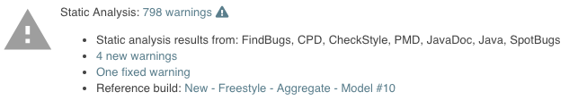 

If this option is not enabled, then for each tool a separate result will be created. This result has a unique URL and
icon, so you quickly see the difference between the created reports:

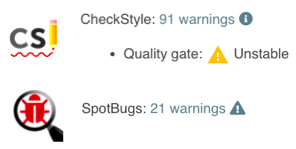 

In the basic configuration section you can additionally choose if the step should run for failed builds as well.
This option is disabled by default, since analysis results might be inaccurate if the build failed.
 
An example pipeline with these options is shown in the following snippet:

```
recordIssues(
    enabledForFailure: true, aggregatingResults: true, 
    tools: [java(), checkStyle(pattern: 'checkstyle-result.xml', reportEncoding: 'UTF-8')]
)
```

If you are using a single tool you can use the property `tool` instead of `tools`: 

```
recordIssues enabledForFailure: true, aggregatingResults: true, tool: checkStyle(pattern: 'checkstyle-result.xml')
```

### Creating support for a custom tool

If none of the built-in tools works in your project you have three ways to add additional tools. 

#### Export your issues into a supported format

A simple way to get the analysis results of your tool into the Warnings plugin is to export the information into one
of the already supported formats. E.g., several tools export their issues into the CheckStyle or PMD format. If you
want to use all features of the Warnings Plugin it would be even better if you would export the information into the
*native* [XML](../src/test/resources/io/jenkins/plugins/analysis/warnings/warnings-issues.xml) or 
[JSON](../src/test/resources/io/jenkins/plugins/analysis/warnings/issues.json) format. 
These formats are already registered in the user interface and you can use them out-of-the-box. You can even provide
issues in a simple log file that contains single lines of JSON issues, see 
[example](../src/test/resources/io/jenkins/plugins/analysis/warnings/json-issues.log).

#### Deploying a new tool using a custom plugin

The most flexible way is to define a new tool by writing a Java class that will be deployed in your own small 
Jenkins plugin, see document ["Providing support for a custom static analysis tool"](Custom-Plugin.md) for details. 

#### Creating a new tool using a Groovy parser

If the format of your log messages is quite simple then you can define support for your tool by creating a simple 
tool configuration in Jenkins' user interface. Due to security reasons (Groovy scripts can compromise your master) 
this configuration is available in the system configuration only. 
The configuration of a new parser takes a regular expression that will be used to 
match the report format. If the expression matches, then a Groovy script will be invoked that converts the matching 
text into an issue instance. Here is an example of such a Groovy based parser:

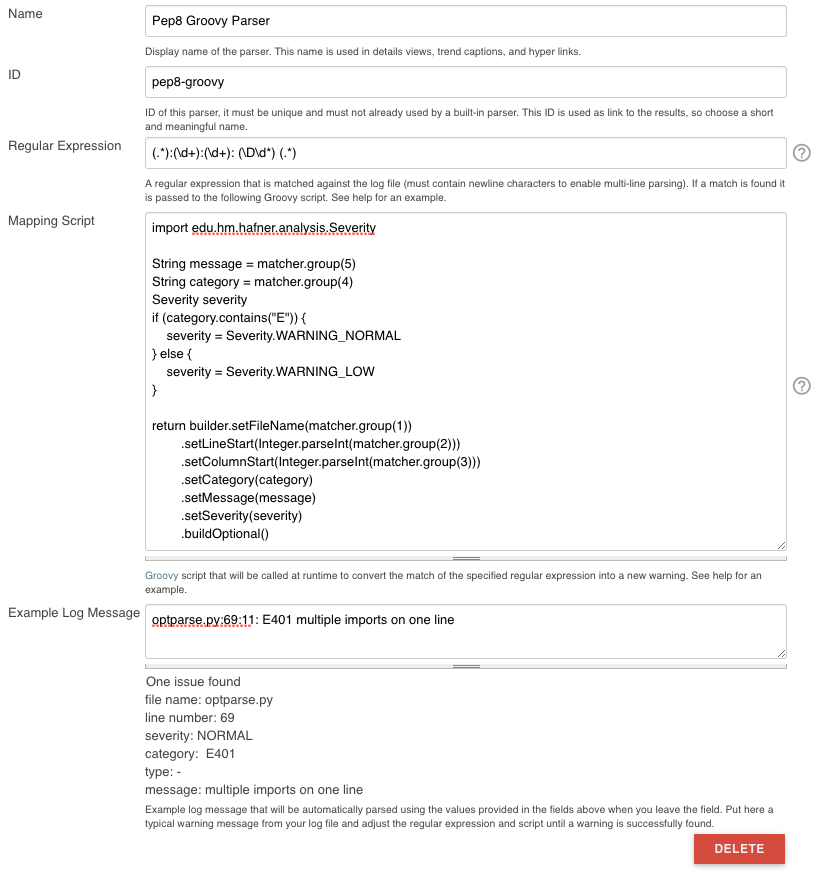  

##### Creating a Groovy parser programmatically

The Groovy based parser can also be created using a Groovy script from within a pipeline, a Jenkins startup script or the script console.

```groovy
def config = io.jenkins.plugins.analysis.warnings.groovy.ParserConfiguration.getInstance()

if(!config.contains('pep8-groovy')){
    def newParser = new io.jenkins.plugins.analysis.warnings.groovy.GroovyParser(
        'pep8-groovy', 
        'Pep8 Groovy Parser', 
        "(.*):(\d+):(\d+): (\D\d*) (.*)", 
        'return builder.setFileName(matcher.group(1)).setCategory(matcher.group(4)).setMessage(matcher.group(5)).buildOptional()', 
        "optparse.py:69:11: E401 multiple imports on one line"
    )
    config.setParsers(config.getParsers().plus(newParser))
}
```

#### Using the defined tool

Once your Groovy parser has been registered you can use it in the tool configuration section of your job: 

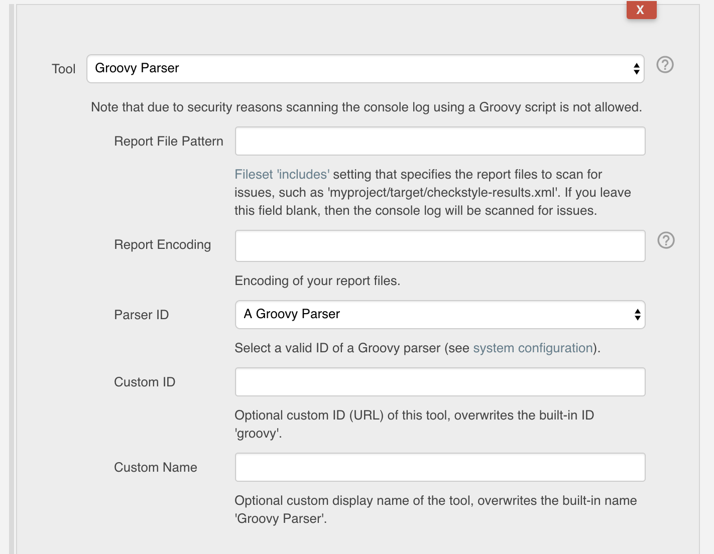  

First of all, you need to choose the tool "Groovy Parser" in order to get the configuration screen for the Groovy
parser. Then you can select the parser from the list of available parsers. This list is dynamically created based
on the parsers that are defined in Jenkins' system configuration section. The custom ID and name properties can 
be set in the same way as for the other tools.

In order to use a Groovy parser in a pipeline you need to use a script statement of the following form:

```
recordIssues sourceCodeEncoding: 'UTF-8', 
    tool: groovyScript(parserId: 'groovy-id-in-system-config', pattern:'**/*report.log', reportEncoding:'UTF-8')
```

### Setting the source code file encoding

In order to let the plugin parse and display your source code files it is required to set the encoding for these
files as well: 

 

An example pipeline with these options is shown in the following snippet, note that the encoding of the report 
files may be set differently if required:

```
recordIssues sourceCodeEncoding: 'ISO-8859-1', tool: java(reportEncoding: 'UTF-8')
```

### Control the selection of the reference build (baseline)

One important feature of the Warnings Next Generation plugin is the classification of issues as new, outstanding and fixed:
- **new**: all issues, that are part of the current report but have not been shown up in the reference report
- **fixed**: all issues, that are part of the reference report but are not present in the current report anymore
- **outstanding**: all issues, that are part of the current and reference report

In order to compute this classification, the plugin requires a reference build (baseline). New, fixed, and outstanding
issues are then computed by comparing the issues in the current build and the baseline. There are three options that
control the selection of the reference build. 

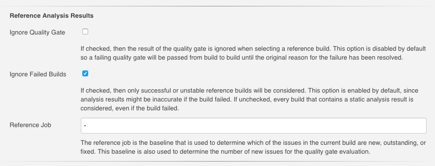 

An example pipeline with these options is shown in the following snippet:

```
recordIssues tool: java(), ignoreQualityGate: false, ignoreFailedBuilds: true, referenceJobName: 'my-project/master'
```

### Filtering issues

The created report of issues can be filtered afterwards. You can specify an arbitrary number of include or exclude 
filters. Currently, there is support for filtering issues by module name, package or namespace name, file name, 
category or type.

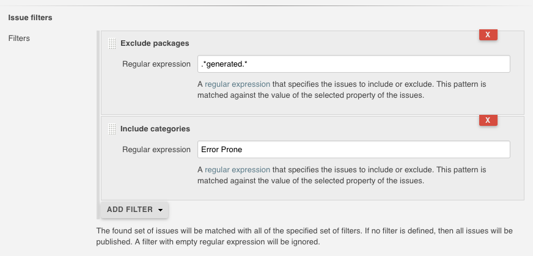 

An example pipeline with these options is shown in the following snippet:

```
recordIssues tool: java(pattern: '*.log'), filters: [includeFile('MyFile.*.java'), excludeCategory('WHITESPACE')]
```

### Quality gate configuration

You can define several quality gates that will be checked after the issues have been reported. These quality gates
let you modify Jenkins' build status so that you immediately see if the desired quality of your product is met. 
A build can be set to **unstable** or **failed** for each of these quality gates. All quality gates use a simple metric:
the number of issues that will fail a given quality gate. 

 

An example pipeline with these options is shown in the following snippet:

```
recordIssues tool: java(pattern: '*.log'), qualityGates: [[threshold: 1, type: 'TOTAL', unstable: true]]
```

The type determines the property that will be picked to evaluate the quality gate. Refer to the enum 
[QualityGateType](../src/main/java/io/jenkins/plugins/analysis/core/util/QualityGate.java) to see which different
types are supported.
 
### Health report configuration

The plugin can participate in the health report of your project. You can change the number of issues
that change the health to 0% and 100%, respectively. Additionally, the severities that should be considered
when creating the health report can be selected.
 
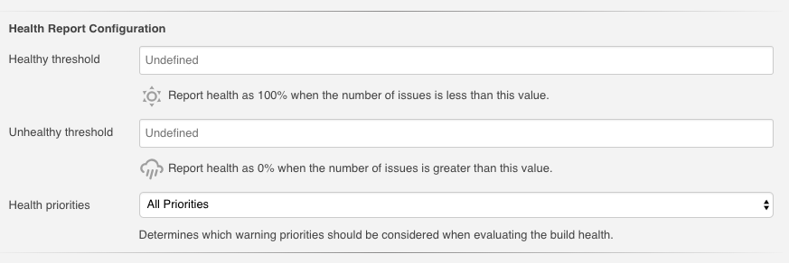 

An example pipeline with these options is shown in the following snippet:

```
recordIssues tool: java(pattern: '*.log'), healthy: 10, unhealthy: 100, minimumSeverity: 'HIGH'
```

This job adjusts the build health based on all warnings with severity HIGH and errors. If the build has 10 warnings
or less then the health is at 100%. If the build has more than 100 warnings, then the health is at 0%.

### Pipeline configuration

Requirements for using the Warnings plugin in Jenkins Pipeline can be complex and sometimes controversial.
In order to be as flexible as possible I decided to split the main step into two individual parts,
which could then be used independently from each other.

#### Simple Pipeline configuration 

The simple pipeline configuration is provided by the step `recordIssues`, it provides the same properties as 
the post build action (see [above](#configuration)). This step scans for issues
in a given set of files (or in the console log) and reports these issues in your build. You can use the 
snippet generator to create a working snippet that calls this step. A typical example of this step 
is shown in the following example:

```
recordIssues(
    enabledForFailure: true, 
    tool: java(pattern: '*.log'), 
    filters: [includeFile('MyFile.*.java'), excludeCategory('WHITESPACE')]
)
```

In this example, the files '*.log' are scanned for **Java** issues. Only issues with a file name matching the 
pattern 'MyFile.\*.java' are included. Issues with category 'WHITESPACE' will be excluded. The
step will be executed even if the build failed. 

In order to see all configuration options you can investigate the 
[step implementation](../src/main/java/io/jenkins/plugins/analysis/core/steps/IssuesRecorder.java).

#### Declarative Pipeline configuration 

Configuration of the plugin in Declarative Pipeline jobs is the same as in Scripted Pipelines, see the following
example that builds the [analysis-model](https://github.com/jenkinsci/analysis-model) library on Jenkins:

```
pipeline {
    agent 'any'
    tools {
        maven 'mvn-default'
        jdk 'jdk-default'
    }
    stages {
        stage ('Build') {
            steps {
                sh '${M2_HOME}/bin/mvn --batch-mode -V -U -e clean verify -Dsurefire.useFile=false -Dmaven.test.failure.ignore'
            }
        }

        stage ('Analysis') {
            steps {
                sh '${M2_HOME}/bin/mvn --batch-mode -V -U -e checkstyle:checkstyle pmd:pmd pmd:cpd findbugs:findbugs spotbugs:spotbugs'
            }
        }
    }
    post {
        always {
            junit testResults: '**/target/surefire-reports/TEST-*.xml'

            recordIssues enabledForFailure: true, tools: [mavenConsole(), java(), javaDoc()]
            recordIssues enabledForFailure: true, tool: checkStyle()
            recordIssues enabledForFailure: true, tool: spotBugs()
            recordIssues enabledForFailure: true, tool: cpd(pattern: '**/target/cpd.xml')
            recordIssues enabledForFailure: true, tool: pmdParser(pattern: '**/target/pmd.xml')
        }
    }
}
```                                              

#### Advanced Pipeline configuration

Sometimes publishing and reporting issues using a single step is not sufficient. E.g., if you build your
product using several parallel steps and you want to combine the issues from all of these steps into 
a single result. Then you need to split scanning and aggregation. The plugin provides the following
two steps:
- `scanForIssues`: this step scans a report file or the console log with a particular parser and creates an 
  intermediate 
  [AnnotatedReport](../src/main/java/io/jenkins/plugins/analysis/core/steps/AnnotatedReport.java) 
  object that contains the report. See 
  [step implementation](../src/main/java/io/jenkins/plugins/analysis/core/steps/ScanForIssuesStep.java) for details.
- `publishIssues`: this step publishes a new report in your build that contains the aggregated results
  of several `scanForIssues` steps. See 
  [step implementation](../src/main/java/io/jenkins/plugins/analysis/core/steps/PublishIssuesStep.java) for details.

Example: 
```
node {
    stage ('Checkout') {
        git branch:'5.0', url: 'git@github.com:jenkinsci/warnings-plugin.git'
    }
    stage ('Build') {
        def mvnHome = tool 'mvn-default'

        sh "${mvnHome}/bin/mvn --batch-mode -V -U -e clean verify -Dsurefire.useFile=false"

        junit testResults: '**/target/*-reports/TEST-*.xml'

        def java = scanForIssues tool: java()
        def javadoc = scanForIssues tool: javaDoc()
        
        publishIssues issues: [java, javadoc], filters: [includePackage('io.jenkins.plugins.analysis.*')]
    }

    stage ('Analysis') {
        def mvnHome = tool 'mvn-default'

        sh "${mvnHome}/bin/mvn -batch-mode -V -U -e checkstyle:checkstyle pmd:pmd pmd:cpd findbugs:findbugs"

        def checkstyle = scanForIssues tool: checkStyle(pattern: '**/target/checkstyle-result.xml')
        publishIssues issues: [checkstyle]
   
        def pmd = scanForIssues tool: pmdParser(pattern: '**/target/pmd.xml')
        publishIssues issues: [pmd]
        
        def cpd = scanForIssues tool: cpd(pattern: '**/target/cpd.xml')
        publishIssues issues: [cpd]
        
        def spotbugs = scanForIssues tool: spotBugs(pattern: '**/target/findbugsXml.xml')
        publishIssues issues: [spotbugs]

        def maven = scanForIssues tool: mavenConsole()
        publishIssues issues: [maven]
        
        publishIssues id: 'analysis', name: 'All Issues', 
            issues: [checkstyle, pmd, spotbugs], 
            filters: [includePackage('io.jenkins.plugins.analysis.*')]
    }

``` 
  
## New features

The most important new features are described in the following sections. 

### Issues history: new, fixed, and outstanding issues

One highlight of the plugin is the ability to categorize issues of subsequent builds as new, fixed and outstanding.

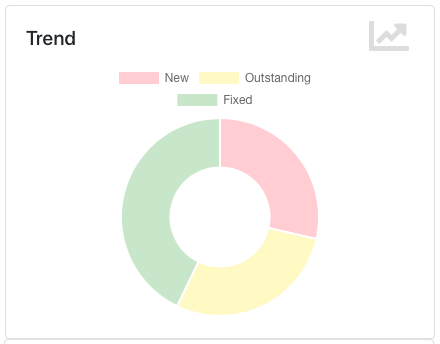 

Using this feature makes it a lot easier to keep the quality of your project under control: you can focus
only on those warnings that have been introduced recently. 

Note: the detection of new warnings is based on a complex algorithm that tries to track the same warning in
two different versions of the source code. Depending on the extent of the modification of the source code
it might produce some false positives, i.e., you might still get some new and fixed warnings even if there should 
be none. The accuracy of this algorithm is still ongoing research and will be refined in the next couple of months. 

### Severities

The plugin shows the distribution of the severities of the issues in a chart. It defines the following 
default severities, but additional ones might be added by plugins that extend the Warnings plugin.

- **Error**: Indicates an error that typically fails the build
- **Warning** (High, Normal, Low): Indicates a warning of the given priority. Mapping to the priorities
is up to the individual parsers.

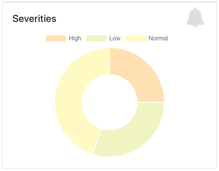 

Note that not every parser is capable of producing warnings with a different severity. Some of the parsers simply
use the same severity for all issues.

### Build trend

In order to see the trend of the analysis results, several charts show the number of issues per build. These charts are
used in the details page as well as in the job overview. The following different trend chart types are currently available:

#### Distribution of issues by severity

The default trend chart shows the total number of issues, stacked by severity. Using this chart you see which severity
contributes the most to the total number of issues. 

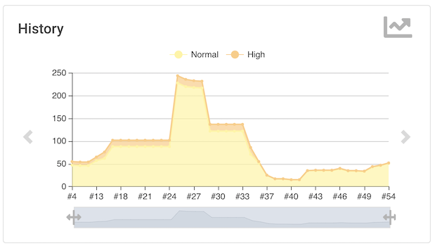
 
#### Issues per static analysis type

If your are aggregating the results of several static analysis results, the type chart shows the number of issues for
each of the tools using an individual line. You can temporarily hide tools by clicking on the corresponding 
legend symbol.   

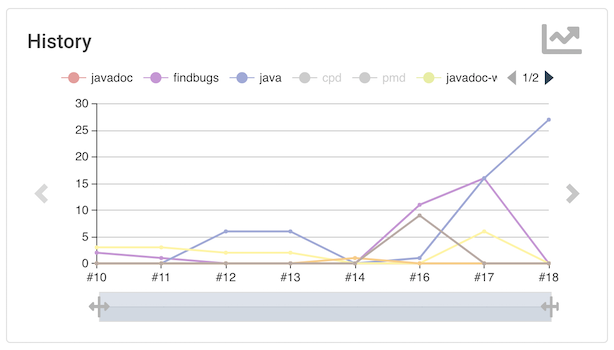 

#### New vs. Fixed issues

If you are interested in your backlog on issues you can open the new-versus-fixed chart. It maps issues 
introduced versus issues fixed over a sequence of builds. This helps you understand whether your overall backlog 
is growing or shrinking.

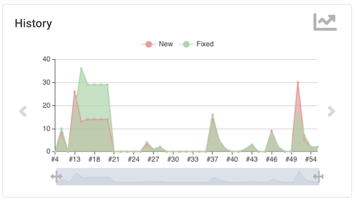 

#### Health of the project

The health chart is only available if health reporting has been enabled. In this case, the trend chart shows how many 
warnings are in the healthy and unhealthy regions. Your project goal should be to let the number of warnings not 
escape the green part of the chart.  

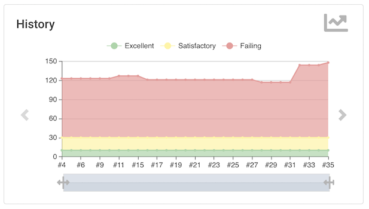 

#### Zooming

All trend charts in the detail views support zooming of the build axis using the range sliders at the bottom of the chart. 

 
 
#### Build vs. Date Axis

All trend charts in the detail views can show the number of warnings per build or per day. You can switch between this 
X-axis variants by selecting the corresponding icon in the top right corner. Each day shows the average number of 
warnings. 

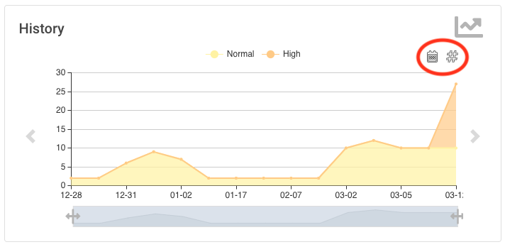 
 
### Issues overview

You can get a fast and efficient overview of the reported set of issues in several aggregation views. 
Depending on the number or type of issues you will see the distribution of issues by
- Static Analysis Tool
- Module
- Package or Namespace
- Severity
- Category
- Type

Each of these detail views are interactive, i.e. you can navigate into a subset of the categorized issues. 

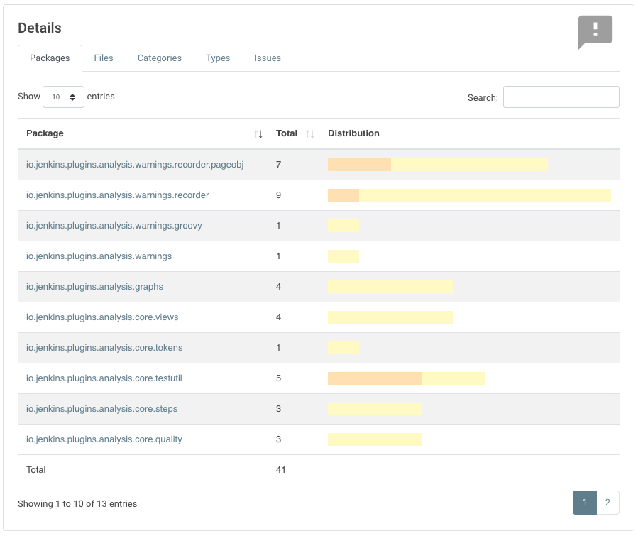 

### Issues details

The set of reported issues is shown in a modern and responsive table. The table is loaded on demand using an Ajax 
call. It provides the following features:

- **Pagination**: the number of issues is subdivided into several pages which can be selected by using the provided page 
links. Note that currently the pagination is done on the client side, i.e. it may take some time to obtain the whole table of 
issues from the server.
- **Sorting**: the table content can be sorted by clicking on ony of the table columns.
- **Filtering, Searching**: you can filter the shown issues by entering some text in the search box.
- **Content Aware**: columns are only shown if there is something useful to display. I.e., if a tool does not report an
issues category, then the category will be automatically hidden.
- **Responsive**: the layout should adapt to the actual screen threshold. 
- **Details**: the details message for an issue (if provided by the corresponding static analysis tool) is shown as 
child row within the table.

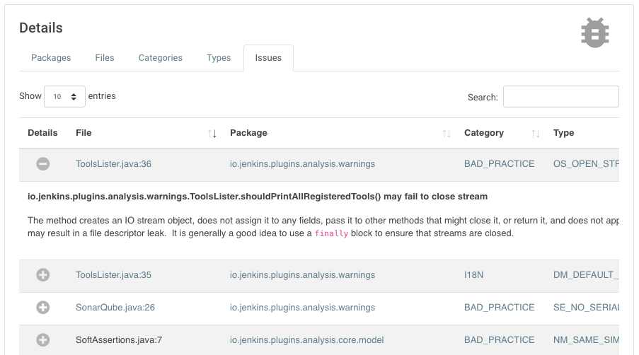 

### Source code blames (for Git projects)

If not disabled in the job configuration, the plugin will execute `git blame` to determine who is the responsible 
'author' of an issue. In the corresponding *Source Control* view all issues will be listed with author name, email and
commit ID. 
  
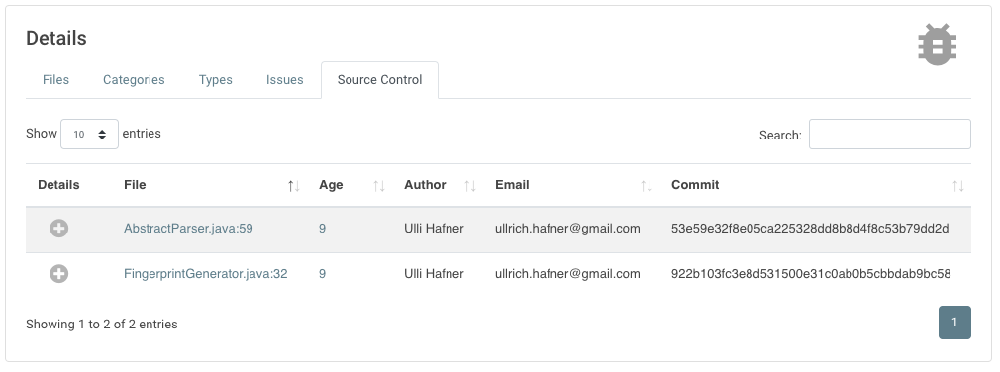 

In order to disable the blame feature, set the property `blameDisabled` to `true`, see the following example:
```
recordIssues blameDisabled: true, tool: java([pattern: '*.log')
```

### Source code view

The source code view now uses the JS library [Prism](https://prismjs.com) to show warnings in an affected file. 
This library provides syntax highlighting for the most popular languages and renders everything on the client side.

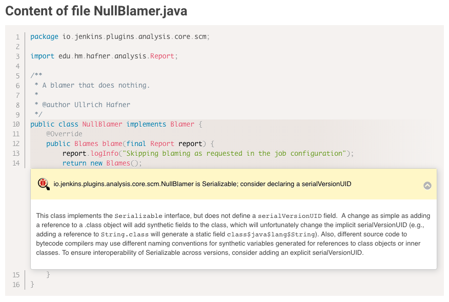

### Dashboard view support

Support for Jenkins [dashboard view](https://wiki.jenkins.io/display/JENKINS/Dashboard+View) is quite limited up to now.
Currently, only one portlet is available, that shows the number of issues for a job (separated by each tool). Moreover,
the visualization is quite ugly, since it is more complex to use modern JS libraries on pages that are not under control
of the warnings plugin.
 
The remaining portlets from the old static analysis collector plugin will be added step by step.

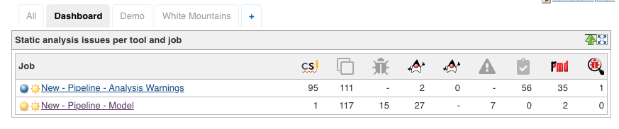

### Configuration as code support

The Warnings Next Generation plugin is compatible with the 
[Configuration as Code plugin](https://github.com/jenkinsci/configuration-as-code-plugin). 
You can import parser configurations (see section [Creating a new tool in the user interface](#creating-a-new-tool-in-the-user-interface)) into Jenkins' system configuration using a YAML configuration in the form 
of the following example: 

```yaml
unclassified:
  warningsParsers:
    parsers:
    - name: "Name of Parser (used in all user interface labels)"
      id: "id" # the ID must be a valid URL
      regexp: ".*"
      script: "Groovy Script"
``` 

### Remote API

The plugin provides the following REST API endpoints. 

#### Aggregation summary of all analysis results

All static analysis tools that have been configured in a build can be queried by using the URL 
`[build-url]/warnings-ng/api/json` (or `[build-url]/warnings-ng/api/xml`). This aggregation shows ID, name, URL and 
total number of issues for each tool.

```json
{
  "_class": "io.jenkins.plugins.analysis.core.restapi.AggregationApi",
  "tools": [
    {
      "id": "maven",
      "latestUrl": "http://localhost:8080/view/White%20Mountains/job/New%20-%20Pipeline%20-%20Simple%20Model/26/maven",
      "name": "Maven Warnings",
      "threshold": 9
    },
    {
      "id": "java",
      "latestUrl": "http://localhost:8080/view/White%20Mountains/job/New%20-%20Pipeline%20-%20Simple%20Model/26/java",
      "name": "Java Warnings",
      "threshold": 1
    },
    {
      "id": "javadoc",
      "latestUrl": "http://localhost:8080/view/White%20Mountains/job/New%20-%20Pipeline%20-%20Simple%20Model/26/javadoc",
      "name": "JavaDoc Warnings",
      "threshold": 0
    },
    {
      "id": "checkstyle",
      "latestUrl": "http://localhost:8080/view/White%20Mountains/job/New%20-%20Pipeline%20-%20Simple%20Model/26/checkstyle",
      "name": "CheckStyle Warnings",
      "threshold": 0
    },
    {
      "id": "pmd",
      "latestUrl": "http://localhost:8080/view/White%20Mountains/job/New%20-%20Pipeline%20-%20Simple%20Model/26/pmd",
      "name": "PMD Warnings",
      "threshold": 671
    },
    {
      "id": "spotbugs",
      "latestUrl": "http://localhost:8080/view/White%20Mountains/job/New%20-%20Pipeline%20-%20Simple%20Model/26/spotbugs",
      "name": "SpotBugs Warnings",
      "threshold": 0
    },
    {
      "id": "cpd",
      "latestUrl": "http://localhost:8080/view/White%20Mountains/job/New%20-%20Pipeline%20-%20Simple%20Model/26/cpd",
      "name": "CPD Warnings",
      "threshold": 123
    },
    {
      "id": "open-tasks",
      "latestUrl": "http://localhost:8080/view/White%20Mountains/job/New%20-%20Pipeline%20-%20Simple%20Model/26/open-tasks",
      "name": "Open Tasks Scanner Warnings",
      "threshold": 11
    }
  ]
}
```

#### Summary of the analysis result

You can obtain a summary of a particular analysis report by using the URL `[build-url]/[tool-id]/api/xml` 
(or `[build-url]/[tool-id]/api/json`). The summary contains the number of issues, the quality gate status, and all 
info and error messages.

Here is an example XML report:

```xml
<analysisResultApi _class='io.jenkins.plugins.analysis.core.restapi.AnalysisResultApi'>
  <totalSize>3</totalSize>
  <fixedSize>0</fixedSize>
  <newSize>0</newSize>
  <noIssuesSinceBuild>-1</noIssuesSinceBuild>
  <successfulSinceBuild>-1</successfulSinceBuild>
  <qualityGateStatus>WARNING</qualityGateStatus>
  <owner _class='org.jenkinsci.plugins.workflow.job.WorkflowRun'>
    <number>46</number>
    <url>http://localhost:8080/view/White%20Mountains/job/Full%20Analysis%20-%20Model/46/</url>
  </owner>
  <infoMessage>Searching for all files in '/tmp/node1/workspace/Full Analysis - Model' that match the pattern
    '**/target/spotbugsXml.xml'
  </infoMessage>
  <infoMessage>-> found 1 file</infoMessage>
  <infoMessage>Successfully parsed file /tmp/node1/workspace/Full Analysis - Model/target/spotbugsXml.xml</infoMessage>
  <infoMessage>-> found 3 issues (skipped 0 duplicates)</infoMessage>
  <infoMessage>Post processing issues on 'node1' with encoding 'UTF-8'</infoMessage>
  <infoMessage>Resolving absolute file names for all issues</infoMessage>
  <infoMessage>-> affected files for all issues already have absolute paths</infoMessage>
  <infoMessage>Copying affected files to Jenkins' build folder /Users/hafner/Development/jenkins/jobs/Full Analysis -
    Model/builds/46
  </infoMessage>
  <infoMessage>-> 2 copied, 0 not in workspace, 0 not-found, 0 with I/O error</infoMessage>
  <infoMessage>Resolving module names from module definitions (build.xml, pom.xml, or Manifest.mf files)</infoMessage>
  <infoMessage>-> all issues already have a valid module name</infoMessage>
  <infoMessage>Resolving package names (or namespaces) by parsing the affected files</infoMessage>
  <infoMessage>-> all affected files already have a valid package name</infoMessage>
  <infoMessage>Creating fingerprints for all affected code blocks to track issues over different builds</infoMessage>
  <infoMessage>No filter has been set, publishing all 3 issues</infoMessage>
  <infoMessage>No valid reference build found - all reported issues will be considered outstanding</infoMessage>
  <infoMessage>Evaluating quality qualityGates</infoMessage>
  <infoMessage>-> WARNING - Total number of issues: 3 - Quality Gate: 1</infoMessage>
  <infoMessage>-> Some quality qualityGates have been missed: overall result is WARNING</infoMessage>
  <infoMessage>Health report is disabled - skipping</infoMessage>
</analysisResultApi>
```

#### Details of the analysis result

The reported issues are also available as REST API. You can either query all issues or only the 
new, fixed, or outstanding issues. The corresponding URLs are:

1. `[build-url]/[tool-id]/all/api/xml`: lists all issues
2. `[build-url]/[tool-id]/fixed/api/xml`: lists all fixed issues
3. `[build-url]/[tool-id]/new/api/xml`: lists all new issues
4. `[build-url]/[tool-id]/outstanding/api/xml`: lists all outstanding issues

Here is an example JSON report:

```json
{
  "_class" : "io.jenkins.plugins.analysis.core.restapi.ReportApi",
  "issues" : [
    {
      "baseName" : "AbstractParser.java",
      "category" : "EXPERIMENTAL",
      "columnEnd" : 0,
      "columnStart" : 0,
      "description" : "",
      "fileName" : "/private/tmp/node1/workspace/Full Analysis - Model/src/main/java/edu/hm/hafner/analysis/AbstractParser.java",
      "fingerprint" : "be18f803030f2af690fbeef09eafa5c9",
      "lineEnd" : 59,
      "lineStart" : 59,
      "message" : "edu.hm.hafner.analysis.AbstractParser.parse(File, Charset, Function) may fail to clean up java.io.InputStream",
      "moduleName" : "Static Analysis Model and Parsers",
      "origin" : "spotbugs",
      "packageName" : "edu.hm.hafner.analysis",
      "reference" : "46",
      "severity" : "LOW",
      "type" : "OBL_UNSATISFIED_OBLIGATION"
    },
    {
      "baseName" : "ReportTest.java",
      "category" : "STYLE",
      "columnEnd" : 0,
      "columnStart" : 0,
      "description" : "",
      "fileName" : "/private/tmp/node1/workspace/Full Analysis - Model/src/test/java/edu/hm/hafner/analysis/ReportTest.java",
      "fingerprint" : "331d509297fad027813365ad0fb37e69",
      "lineEnd" : 621,
      "lineStart" : 621,
      "message" : "Return value of Report.get(int) ignored, but method has no side effect",
      "moduleName" : "Static Analysis Model and Parsers",
      "origin" : "spotbugs",
      "packageName" : "edu.hm.hafner.analysis",
      "reference" : "46",
      "severity" : "LOW",
      "type" : "RV_RETURN_VALUE_IGNORED_NO_SIDE_EFFECT"
    },
    {
      "baseName" : "ReportTest.java",
      "category" : "STYLE",
      "columnEnd" : 0,
      "columnStart" : 0,
      "description" : "",
      "fileName" : "/private/tmp/node1/workspace/Full Analysis - Model/src/test/java/edu/hm/hafner/analysis/ReportTest.java",
      "fingerprint" : "1e641f9c0b35ed97140d639695e8ce18",
      "lineEnd" : 624,
      "lineStart" : 624,
      "message" : "Return value of Report.get(int) ignored, but method has no side effect",
      "moduleName" : "Static Analysis Model and Parsers",
      "origin" : "spotbugs",
      "packageName" : "edu.hm.hafner.analysis",
      "reference" : "46",
      "severity" : "LOW",
      "type" : "RV_RETURN_VALUE_IGNORED_NO_SIDE_EFFECT"
    }
  ],
  "threshold" : 3
}
```

### Token macro support

The Warnings plugin provides the token `ANALYSIS_ISSUES_COUNT` that could be used in additional post build processing
steps, e.g. in the mailer. In order to use this token you need to install the latest release of the 
[Token Macro plugin](https://plugins.jenkins.io/token-macro). 
The token has an optional parameter `tool` that could be used to select a particular analysis result. 
Examples:

- `${ANALYSIS_ISSUES_COUNT}`: expands to the aggregated number of issues of all analysis tools
- `${ANALYSIS_ISSUES_COUNT, tool="checkstyle"}`: expands to the total number of **CheckStyle** issues

## Transition from the static analysis suite

Previously the same set of features has been provided by the plugins of the static analysis suite 
(CheckStyle, PMD, FindBugs, Static Analysis Utilities, Analysis Collector, Task Scanner, Warnings etc.). 
In order to simplify the user experience and the development process, these
plugins and the core functionality have been merged into the Warnings Next Generation plugin. 
These old static analysis plugins are not required anymore and are now end-of-life. 
If you currently use one of these old plugins you should migrate
to the new recorders and steps as soon as possible. I will still maintain the old code for a while, 
but the main development effort will be spent into the new code base. 

### Migration of Pipelines

Pipelines calling the old static analysis steps (e.g., `findbugs`, `checkstyle`, etc.) need to call the new `recordIssues` 
step now. The same step is used for all static analysis tools, the actual parser is selected
by using the step property `tools`. For more details on the set of available parameters please see section 
[Configuration](#configuration).     

### Migration of all other jobs

Freestyle, Matrix or Maven Jobs using the old API used a so called **Post Build Action** that was provided by 
each individual plugin. E.g., the FindBugs plugin did provide the post build action 
*"Publish FindBugs analysis results"*. These old plugin specific actions are not supported anymore, 
they are now marked with *\[Deprecated\]* in the user interface. 
Now you need to add a new post build step - this step now is called 
*"Record compiler warnings and static analysis results"* for all static analysis tools. The selection of the tool is part of the configuration of this post build step. 
Note: the warnings produced by a post build step using the old API cannot not be read by the new post build actions.
I.e., you can't see a combined history of the old and new results - you simply see two unrelated results. There is
also no automatic conversion of results stored in the old format available.

### Migration of plugins depending on analysis-core

The following plugins have been integrated into this new version of the Warnings plugin:

- Android-Lint Plugin
- CheckStyle Plugin
- CCM Plugin
- Dry Plugin
- PMD Plugin
- FindBugs Plugin
- Tasks Scanner Plugin
- Warnings Plugin

All other plugins still need to be integrated or need to be refactored to use the new API.
